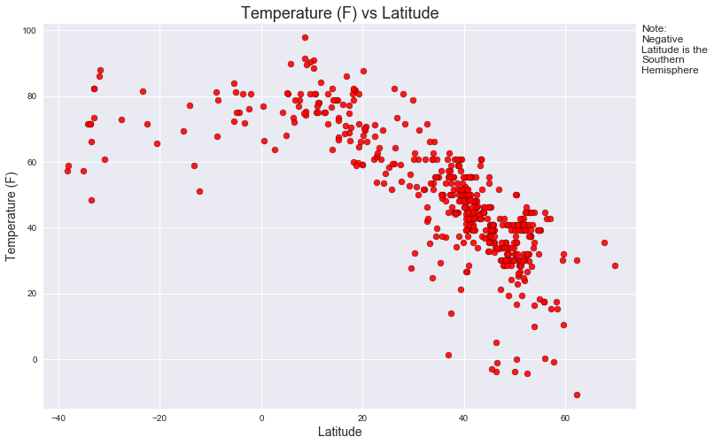
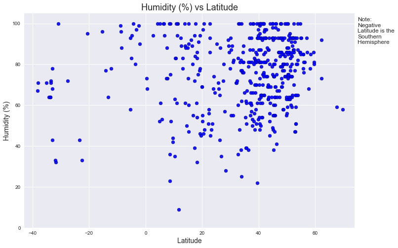
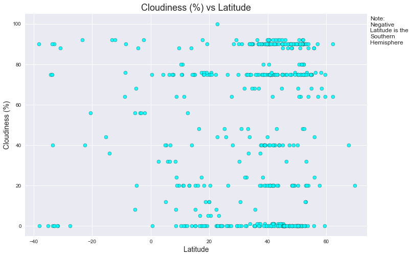
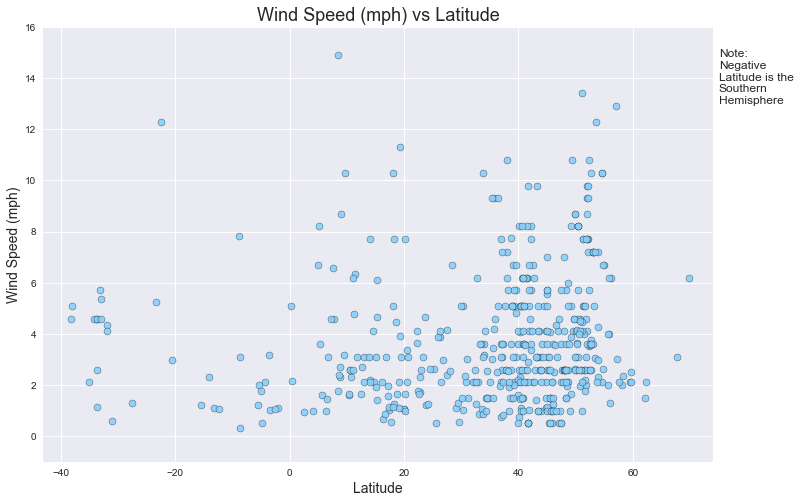

# Analysis
Observed trend 1: <br>
>When comparing temperature to the latitude, you can see a clear peak at the equator (0 degrees). This would indicate that the hottest temperatures happen around the equator, which would follow the logic that those areas tend to get the most direct sunlight. The farther north or south you move from the equator, the lower you see the temperatures go, however, there is a noticable difference bettwen the rate at which the northern hemisphere cools vs the southern. Using more city data would be needed to fully see this trend and to possibly make a model to predict a temperature at a given latitude.<br>
<br>

Observed trend 2:<br>
>Interestingly, we see the greatest difference in humidity (%) at the equator. This could be due to the range of vegetaion in the surrounding areas where each reading was taken. For example, a desert environment in Africa might have a very low humidity due to the low presence of water. While on the other hand, the Rain Forrests of the Amazon offer lush vegetation and ample water to be dispersed into the air, causing high humidity readings. You rarely find these types of extremes as you approach the poles of the planet, mostly due to the effect temperature has on water - which is what humidity is based on.<br>
<br>

Observed trend 3:<br>
>Cloudiness doesn't tell us much on a daily basis, other than what cities MIGHT have had some form of percipitation fall. Of the data from the day, we can see that it was fairly cloudy in the northen hemisphere in certain areas, while other areas remained completely clear. Without investigating further and correlating each data point on the graph with its geographical location, it's hard to really say which area might have had the most cloud-cover and which might've had the least. <br>
<br>


```python
# Importing Dependencies
import matplotlib.pyplot as plt
import requests
import openweathermapy.core as ow
import pandas as pd
import os
import json
import citipy
import random
import numpy as np
import seaborn as sb
import time
```


```python
# Loading API Keys and Setting up Save Path
api_dir = os.path.dirname(os.path.dirname(os.path.dirname(os.path.dirname(os.path.realpath('__file__')))))
file_name = os.path.join(api_dir, "api_keys.json")
data = json.load(open(file_name))

wkey = data['open_weather_map_api_key']
```


```python
# Take in cities and coords database
cities_file = os.path.join("Resources", "cities1000.csv")
cities_data_df = pd.read_csv(cities_file)

# Create random sample of cities to have coords to use
sample_cities_df = cities_data_df.sample(n=500, random_state=20)
sample_cities_df.head()
```


<div>
<style>
    .dataframe thead tr:only-child th {
        text-align: right;
    }

    .dataframe thead th {
        text-align: left;
    }

    .dataframe tbody tr th {
        vertical-align: top;
    }
</style>
<table border="1" class="dataframe">
  <thead>
    <tr style="text-align: right;">
      <th></th>
      <th>City</th>
      <th>Latitude</th>
      <th>Longitude</th>
      <th>Country Code</th>
    </tr>
  </thead>
  <tbody>
    <tr>
      <th>79101</th>
      <td>Grou</td>
      <td>53.09456</td>
      <td>5.83745</td>
      <td>NL</td>
    </tr>
    <tr>
      <th>118623</th>
      <td>Augusta</td>
      <td>42.97479</td>
      <td>-75.50129</td>
      <td>US</td>
    </tr>
    <tr>
      <th>42604</th>
      <td>Wilmcote</td>
      <td>52.22081</td>
      <td>-1.76528</td>
      <td>GB</td>
    </tr>
    <tr>
      <th>112715</th>
      <td>Belpre</td>
      <td>39.27396</td>
      <td>-81.5729</td>
      <td>US</td>
    </tr>
    <tr>
      <th>26285</th>
      <td>Abū al Maţāmīr</td>
      <td>30.91018</td>
      <td>30.17438</td>
      <td>EG</td>
    </tr>
  </tbody>
</table>
</div>


```python
# Setting up sentiments
url = 0
counter = 0
weather_dict = {"city" : [],
                "country_code" : [],
                "lat" :  [],
                "lng" : [],
                "temp" : [],
                "temp_min" : [],
                "temp_max" : [],
                "humidity" : [],
                "cloudiness" : [],
                "wind_speed" :  [],
                "url": []
                }

# Starting loop to gather urls
for index, row in sample_cities_df.iterrows():
    
    # Creating URL for each lat and long set   
    url = "https://api.openweathermap.org/data/2.5/weather?lat=" + str(row['Latitude']) + "&lon=" + \
            str(row['Longitude']) + "&appid=" + wkey
    
    # Creating Sleep
    time.sleep(1)
    
    # Calling API
    weather_json = requests.get(url).json()
    
    # Trying to grab API data
    try:
        weather_dict['city'].append(weather_json['name'])
    except:
        weather_dict['city'].append("None")
    try:
        weather_dict['country_code'].append(weather_json['sys']['country'])
    except:
        weather_dict['country_code'].append("None")
        
    weather_dict['lat'].append(weather_json['coord']['lat'])
    weather_dict['lng'].append(weather_json['coord']['lon'])
    weather_dict['temp'].append(weather_json['main']['temp'] * (9/5) - 459.67)
    weather_dict['temp_min'].append(weather_json['main']['temp_min'] * (9/5) - 459.67)
    weather_dict['temp_max'].append(weather_json['main']['temp_max'] * (9/5) - 459.67)
    weather_dict['humidity'].append(weather_json['main']['humidity'])
    weather_dict['cloudiness'].append(weather_json['clouds']['all'])
    weather_dict['wind_speed'].append(weather_json['wind']['speed'])
    weather_dict['url'].append(url)

    # Incrementing counter for status
    counter += 1
    
    # Creating printout of status
    print(f"Processing City Number: {counter} out of {len(sample_cities_df.index)}")
    print(f"Index Number: {index}")
    try:
        print(f"City and Country Code: {weather_json['name']}, {weather_json['sys']['country']}")
    except:
        print(f"City and Country Code: {weather_json['name']}")
    print(f"API URL: {url}")
    
# Creates a DF to use of all the data
weather_sample_df = pd.DataFrame(weather_dict)

# Saves previous said DF to a csv
weather_sample_df.to_csv('Resources/weather_sample_df.csv', encoding='utf-8')
```

    Processing City Number: 1 out of 500
    Index Number: 79101
    City and Country Code: Grou, NL
    API URL: https://api.openweathermap.org/data/2.5/weather?lat=53.09456&lon=5.83745&appid=de6eeb5e838ae1aee6c66e7e9de1f551
    Processing City Number: 2 out of 500
    Index Number: 118623
    City and Country Code: New York, US
    API URL: https://api.openweathermap.org/data/2.5/weather?lat=42.97479&lon=-75.50129&appid=de6eeb5e838ae1aee6c66e7e9de1f551
    Processing City Number: 3 out of 500
    Index Number: 42604
    City and Country Code: Stratford-upon-Avon, GB
    API URL: https://api.openweathermap.org/data/2.5/weather?lat=52.22081&lon=-1.76528&appid=de6eeb5e838ae1aee6c66e7e9de1f551
    Processing City Number: 4 out of 500
    Index Number: 112715
    City and Country Code: Belpre, US
    API URL: https://api.openweathermap.org/data/2.5/weather?lat=39.27396&lon=-81.5729&appid=de6eeb5e838ae1aee6c66e7e9de1f551
    Processing City Number: 5 out of 500
    Index Number: 26285
    City and Country Code: Abu al Matamir, EG
    API URL: https://api.openweathermap.org/data/2.5/weather?lat=30.91018&lon=30.17438&appid=de6eeb5e838ae1aee6c66e7e9de1f551
    Processing City Number: 6 out of 500
    Index Number: 64264
    City and Country Code: Alfedena, IT
    API URL: https://api.openweathermap.org/data/2.5/weather?lat=41.73545&lon=14.035&appid=de6eeb5e838ae1aee6c66e7e9de1f551
    Processing City Number: 7 out of 500
    Index Number: 92485
    City and Country Code: Savarsin, RO
    API URL: https://api.openweathermap.org/data/2.5/weather?lat=46.01667&lon=22.23333&appid=de6eeb5e838ae1aee6c66e7e9de1f551
    Processing City Number: 8 out of 500
    Index Number: 40279
    City and Country Code: Dammarie, FR
    API URL: https://api.openweathermap.org/data/2.5/weather?lat=48.34314&lon=1.49444&appid=de6eeb5e838ae1aee6c66e7e9de1f551
    Processing City Number: 9 out of 500
    Index Number: 67354
    City and Country Code: Ash Shajarah, JO
    API URL: https://api.openweathermap.org/data/2.5/weather?lat=32.64391&lon=35.94175&appid=de6eeb5e838ae1aee6c66e7e9de1f551
    Processing City Number: 10 out of 500
    Index Number: 17236
    City and Country Code: Lucany nad Nisou, CZ
    API URL: https://api.openweathermap.org/data/2.5/weather?lat=50.74136&lon=15.22046&appid=de6eeb5e838ae1aee6c66e7e9de1f551
    Processing City Number: 11 out of 500
    Index Number: 45770
    City and Country Code: Broadway, GB
    API URL: https://api.openweathermap.org/data/2.5/weather?lat=52.03825&lon=-1.86079&appid=de6eeb5e838ae1aee6c66e7e9de1f551
    Processing City Number: 12 out of 500
    Index Number: 64552
    City and Country Code: SantAgata li Battiati, IT
    API URL: https://api.openweathermap.org/data/2.5/weather?lat=37.56494&lon=15.07863&appid=de6eeb5e838ae1aee6c66e7e9de1f551
    Processing City Number: 13 out of 500
    Index Number: 72463
    City and Country Code: Chilon, MX
    API URL: https://api.openweathermap.org/data/2.5/weather?lat=17.22715&lon=-92.41511&appid=de6eeb5e838ae1aee6c66e7e9de1f551
    Processing City Number: 14 out of 500
    Index Number: 122628
    City and Country Code: Carriage Club, US
    API URL: https://api.openweathermap.org/data/2.5/weather?lat=39.53249&lon=-104.90109&appid=de6eeb5e838ae1aee6c66e7e9de1f551
    Processing City Number: 15 out of 500
    Index Number: 57580
    City and Country Code: San Cipirello, IT
    API URL: https://api.openweathermap.org/data/2.5/weather?lat=37.96067&lon=13.17732&appid=de6eeb5e838ae1aee6c66e7e9de1f551
    Processing City Number: 16 out of 500
    Index Number: 52944
    City and Country Code: Athy, IE
    API URL: https://api.openweathermap.org/data/2.5/weather?lat=52.99139&lon=-6.98028&appid=de6eeb5e838ae1aee6c66e7e9de1f551
    Processing City Number: 17 out of 500
    Index Number: 27799
    City and Country Code: Carcaixent, ES
    API URL: https://api.openweathermap.org/data/2.5/weather?lat=39.1218&lon=-0.44812&appid=de6eeb5e838ae1aee6c66e7e9de1f551
    Processing City Number: 18 out of 500
    Index Number: 44650
    City and Country Code: Hemingford Grey, GB
    API URL: https://api.openweathermap.org/data/2.5/weather?lat=52.31756&lon=-0.10029&appid=de6eeb5e838ae1aee6c66e7e9de1f551
    Processing City Number: 19 out of 500
    Index Number: 71740
    City and Country Code: Zongozotla, MX
    API URL: https://api.openweathermap.org/data/2.5/weather?lat=20.00037&lon=-97.65526&appid=de6eeb5e838ae1aee6c66e7e9de1f551
    Processing City Number: 20 out of 500
    Index Number: 82344
    City and Country Code: Kokopo, PG
    API URL: https://api.openweathermap.org/data/2.5/weather?lat=-4.35202&lon=152.26327&appid=de6eeb5e838ae1aee6c66e7e9de1f551
    Processing City Number: 21 out of 500
    Index Number: 12247
    City and Country Code: San Antonio, CL
    API URL: https://api.openweathermap.org/data/2.5/weather?lat=-33.59473&lon=-71.60746&appid=de6eeb5e838ae1aee6c66e7e9de1f551
    Processing City Number: 22 out of 500
    Index Number: 127050
    City and Country Code: Burgersdorp, ZA
    API URL: https://api.openweathermap.org/data/2.5/weather?lat=-30.99766&lon=26.32862&appid=de6eeb5e838ae1aee6c66e7e9de1f551
    Processing City Number: 23 out of 500
    Index Number: 58219
    City and Country Code: Bova Marina, IT
    API URL: https://api.openweathermap.org/data/2.5/weather?lat=37.93503&lon=15.91736&appid=de6eeb5e838ae1aee6c66e7e9de1f551
    Processing City Number: 24 out of 500
    Index Number: 13750
    City and Country Code: Lingcheng, CN
    API URL: https://api.openweathermap.org/data/2.5/weather?lat=22.70722&lon=110.34917&appid=de6eeb5e838ae1aee6c66e7e9de1f551
    Processing City Number: 25 out of 500
    Index Number: 115788
    City and Country Code: Carbon Cliff, US
    API URL: https://api.openweathermap.org/data/2.5/weather?lat=41.49476&lon=-90.39068&appid=de6eeb5e838ae1aee6c66e7e9de1f551
    Processing City Number: 26 out of 500
    Index Number: 174
    City and Country Code: Khandud, AF
    API URL: https://api.openweathermap.org/data/2.5/weather?lat=36.95127&lon=72.318&appid=de6eeb5e838ae1aee6c66e7e9de1f551
    Processing City Number: 27 out of 500
    Index Number: 44286
    City and Country Code: Leatherhead, GB
    API URL: https://api.openweathermap.org/data/2.5/weather?lat=51.29652&lon=-0.3338&appid=de6eeb5e838ae1aee6c66e7e9de1f551
    Processing City Number: 28 out of 500
    Index Number: 73816
    City and Country Code: Hidalgo del Parral, MX
    API URL: https://api.openweathermap.org/data/2.5/weather?lat=26.76209&lon=-105.58523&appid=de6eeb5e838ae1aee6c66e7e9de1f551
    Processing City Number: 29 out of 500
    Index Number: 3331
    City and Country Code: Gries im Sellrain, AT
    API URL: https://api.openweathermap.org/data/2.5/weather?lat=47.19554&lon=11.15619&appid=de6eeb5e838ae1aee6c66e7e9de1f551
    Processing City Number: 30 out of 500
    Index Number: 92777
    City and Country Code: Baleni Sarbi, RO
    API URL: https://api.openweathermap.org/data/2.5/weather?lat=44.83927&lon=25.62082&appid=de6eeb5e838ae1aee6c66e7e9de1f551
    Processing City Number: 31 out of 500
    Index Number: 31735
    City and Country Code: Colmenar Viejo, ES
    API URL: https://api.openweathermap.org/data/2.5/weather?lat=40.65909&lon=-3.76762&appid=de6eeb5e838ae1aee6c66e7e9de1f551
    Processing City Number: 32 out of 500
    Index Number: 98014
    City and Country Code: Tagan’kovo, RU
    API URL: https://api.openweathermap.org/data/2.5/weather?lat=55.67417&lon=37.04028&appid=de6eeb5e838ae1aee6c66e7e9de1f551
    Processing City Number: 33 out of 500
    Index Number: 75954
    City and Country Code: Copanatoyac, MX
    API URL: https://api.openweathermap.org/data/2.5/weather?lat=17.34194&lon=-98.94917&appid=de6eeb5e838ae1aee6c66e7e9de1f551
    Processing City Number: 34 out of 500
    Index Number: 46480
    City and Country Code: Benwell, GB
    API URL: https://api.openweathermap.org/data/2.5/weather?lat=54.97296&lon=-1.66926&appid=de6eeb5e838ae1aee6c66e7e9de1f551
    Processing City Number: 35 out of 500
    Index Number: 55208
    City and Country Code: Jaora, IN
    API URL: https://api.openweathermap.org/data/2.5/weather?lat=23.63783&lon=75.12711&appid=de6eeb5e838ae1aee6c66e7e9de1f551
    Processing City Number: 36 out of 500
    Index Number: 53411
    City and Country Code: Tirunelveli, IN
    API URL: https://api.openweathermap.org/data/2.5/weather?lat=8.72742&lon=77.6838&appid=de6eeb5e838ae1aee6c66e7e9de1f551
    Processing City Number: 37 out of 500
    Index Number: 87590
    City and Country Code: Sedziszow Malopolski, PL
    API URL: https://api.openweathermap.org/data/2.5/weather?lat=50.07069&lon=21.70062&appid=de6eeb5e838ae1aee6c66e7e9de1f551
    Processing City Number: 38 out of 500
    Index Number: 96644
    City and Country Code: Vybor, RU
    API URL: https://api.openweathermap.org/data/2.5/weather?lat=57.22716&lon=29.1663&appid=de6eeb5e838ae1aee6c66e7e9de1f551
    Processing City Number: 39 out of 500
    Index Number: 105290
    City and Country Code: Esme, TR
    API URL: https://api.openweathermap.org/data/2.5/weather?lat=37.15569&lon=40.64142&appid=de6eeb5e838ae1aee6c66e7e9de1f551
    Processing City Number: 40 out of 500
    Index Number: 13758
    City and Country Code: Lichuan, CN
    API URL: https://api.openweathermap.org/data/2.5/weather?lat=30.3&lon=108.85&appid=de6eeb5e838ae1aee6c66e7e9de1f551
    Processing City Number: 41 out of 500
    Index Number: 126658
    City and Country Code: Al Mahfid, YE
    API URL: https://api.openweathermap.org/data/2.5/weather?lat=14.05847&lon=46.91329&appid=de6eeb5e838ae1aee6c66e7e9de1f551
    Processing City Number: 42 out of 500
    Index Number: 53896
    City and Country Code: Rangia, IN
    API URL: https://api.openweathermap.org/data/2.5/weather?lat=26.44931&lon=91.61356&appid=de6eeb5e838ae1aee6c66e7e9de1f551
    Processing City Number: 43 out of 500
    Index Number: 36326
    City and Country Code: Reuilly, FR
    API URL: https://api.openweathermap.org/data/2.5/weather?lat=47.08476&lon=2.04305&appid=de6eeb5e838ae1aee6c66e7e9de1f551
    Processing City Number: 44 out of 500
    Index Number: 115970
    City and Country Code: Kirkland, US
    API URL: https://api.openweathermap.org/data/2.5/weather?lat=42.09253&lon=-88.85121&appid=de6eeb5e838ae1aee6c66e7e9de1f551
    Processing City Number: 45 out of 500
    Index Number: 119741
    City and Country Code: Kenton, US
    API URL: https://api.openweathermap.org/data/2.5/weather?lat=40.647&lon=-83.60965&appid=de6eeb5e838ae1aee6c66e7e9de1f551
    Processing City Number: 46 out of 500
    Index Number: 108501
    City and Country Code: Cowarts, US
    API URL: https://api.openweathermap.org/data/2.5/weather?lat=31.20018&lon=-85.30465&appid=de6eeb5e838ae1aee6c66e7e9de1f551
    Processing City Number: 47 out of 500
    Index Number: 75808
    City and Country Code: Chacalapa Acapulco, MX
    API URL: https://api.openweathermap.org/data/2.5/weather?lat=16.8425&lon=-99.64056&appid=de6eeb5e838ae1aee6c66e7e9de1f551
    Processing City Number: 48 out of 500
    Index Number: 32686
    City and Country Code: Arcos de la Sierra, ES
    API URL: https://api.openweathermap.org/data/2.5/weather?lat=40.34664&lon=-2.1131&appid=de6eeb5e838ae1aee6c66e7e9de1f551
    Processing City Number: 49 out of 500
    Index Number: 67604
    City and Country Code: Ozu, JP
    API URL: https://api.openweathermap.org/data/2.5/weather?lat=32.8804&lon=130.87161&appid=de6eeb5e838ae1aee6c66e7e9de1f551
    Processing City Number: 50 out of 500
    Index Number: 16710
    City and Country Code: Usti nad Orlici, CZ
    API URL: https://api.openweathermap.org/data/2.5/weather?lat=49.97387&lon=16.39361&appid=de6eeb5e838ae1aee6c66e7e9de1f551
    Processing City Number: 51 out of 500
    Index Number: 32355
    City and Country Code: Boadilla del Camino, ES
    API URL: https://api.openweathermap.org/data/2.5/weather?lat=42.25934&lon=-4.34525&appid=de6eeb5e838ae1aee6c66e7e9de1f551
    Processing City Number: 52 out of 500
    Index Number: 87946
    City and Country Code: Lomazy, PL
    API URL: https://api.openweathermap.org/data/2.5/weather?lat=51.90435&lon=23.17656&appid=de6eeb5e838ae1aee6c66e7e9de1f551
    Processing City Number: 53 out of 500
    Index Number: 29515
    City and Country Code: San Justo de la Vega, ES
    API URL: https://api.openweathermap.org/data/2.5/weather?lat=42.45696&lon=-6.01825&appid=de6eeb5e838ae1aee6c66e7e9de1f551
    Processing City Number: 54 out of 500
    Index Number: 63716
    City and Country Code: Boville Ernica, IT
    API URL: https://api.openweathermap.org/data/2.5/weather?lat=41.64252&lon=13.4727&appid=de6eeb5e838ae1aee6c66e7e9de1f551
    Processing City Number: 55 out of 500
    Index Number: 98359
    City and Country Code: Kushva, RU
    API URL: https://api.openweathermap.org/data/2.5/weather?lat=58.29056&lon=59.75917&appid=de6eeb5e838ae1aee6c66e7e9de1f551
    Processing City Number: 56 out of 500
    Index Number: 115420
    City and Country Code: Torrington, US
    API URL: https://api.openweathermap.org/data/2.5/weather?lat=41.80065&lon=-73.12122&appid=de6eeb5e838ae1aee6c66e7e9de1f551
    Processing City Number: 57 out of 500
    Index Number: 89818
    City and Country Code: Czestochowa, PL
    API URL: https://api.openweathermap.org/data/2.5/weather?lat=50.79646&lon=19.12409&appid=de6eeb5e838ae1aee6c66e7e9de1f551
    Processing City Number: 58 out of 500
    Index Number: 78605
    City and Country Code: Heijplaat, NL
    API URL: https://api.openweathermap.org/data/2.5/weather?lat=51.88833&lon=4.38889&appid=de6eeb5e838ae1aee6c66e7e9de1f551
    Processing City Number: 59 out of 500
    Index Number: 121637
    City and Country Code: Whiteriver, US
    API URL: https://api.openweathermap.org/data/2.5/weather?lat=33.83699&lon=-109.96427&appid=de6eeb5e838ae1aee6c66e7e9de1f551
    Processing City Number: 60 out of 500
    Index Number: 65488
    City and Country Code: Pieranica, IT
    API URL: https://api.openweathermap.org/data/2.5/weather?lat=45.42617&lon=9.61026&appid=de6eeb5e838ae1aee6c66e7e9de1f551
    Processing City Number: 61 out of 500
    Index Number: 58869
    City and Country Code: Torre dePicenardi, IT
    API URL: https://api.openweathermap.org/data/2.5/weather?lat=45.14317&lon=10.28803&appid=de6eeb5e838ae1aee6c66e7e9de1f551
    Processing City Number: 62 out of 500
    Index Number: 15478
    City and Country Code: Quinchia, CO
    API URL: https://api.openweathermap.org/data/2.5/weather?lat=5.33957&lon=-75.73018&appid=de6eeb5e838ae1aee6c66e7e9de1f551
    Processing City Number: 63 out of 500
    Index Number: 42607
    City and Country Code: Willington, GB
    API URL: https://api.openweathermap.org/data/2.5/weather?lat=52.13409&lon=-0.37235&appid=de6eeb5e838ae1aee6c66e7e9de1f551
    Processing City Number: 64 out of 500
    Index Number: 126528
    City and Country Code: Sayhut, YE
    API URL: https://api.openweathermap.org/data/2.5/weather?lat=15.21056&lon=51.24556&appid=de6eeb5e838ae1aee6c66e7e9de1f551
    Processing City Number: 65 out of 500
    Index Number: 110572
    City and Country Code: Mission Hills, US
    API URL: https://api.openweathermap.org/data/2.5/weather?lat=39.01778&lon=-94.6169&appid=de6eeb5e838ae1aee6c66e7e9de1f551
    Processing City Number: 66 out of 500
    Index Number: 60159
    City and Country Code: Quarona, IT
    API URL: https://api.openweathermap.org/data/2.5/weather?lat=45.76044&lon=8.26749&appid=de6eeb5e838ae1aee6c66e7e9de1f551
    Processing City Number: 67 out of 500
    Index Number: 71322
    City and Country Code: Arvayheer, MN
    API URL: https://api.openweathermap.org/data/2.5/weather?lat=46.26389&lon=102.775&appid=de6eeb5e838ae1aee6c66e7e9de1f551
    Processing City Number: 68 out of 500
    Index Number: 85176
    City and Country Code: Guiguinto, PH
    API URL: https://api.openweathermap.org/data/2.5/weather?lat=14.83333&lon=120.88333&appid=de6eeb5e838ae1aee6c66e7e9de1f551
    Processing City Number: 69 out of 500
    Index Number: 47168
    City and Country Code: Voula, GR
    API URL: https://api.openweathermap.org/data/2.5/weather?lat=37.84221&lon=23.77651&appid=de6eeb5e838ae1aee6c66e7e9de1f551
    Processing City Number: 70 out of 500
    Index Number: 102035
    City and Country Code: Akersberga, SE
    API URL: https://api.openweathermap.org/data/2.5/weather?lat=59.47944&lon=18.29967&appid=de6eeb5e838ae1aee6c66e7e9de1f551
    Processing City Number: 71 out of 500
    Index Number: 24392
    City and Country Code: Bad Mergentheim, DE
    API URL: https://api.openweathermap.org/data/2.5/weather?lat=49.4925&lon=9.77361&appid=de6eeb5e838ae1aee6c66e7e9de1f551
    Processing City Number: 72 out of 500
    Index Number: 73580
    City and Country Code: Dzuiché, MX
    API URL: https://api.openweathermap.org/data/2.5/weather?lat=20.16542&lon=-88.46398&appid=de6eeb5e838ae1aee6c66e7e9de1f551
    Processing City Number: 73 out of 500
    Index Number: 47908
    City and Country Code: Pella, GR
    API URL: https://api.openweathermap.org/data/2.5/weather?lat=40.76169&lon=22.52637&appid=de6eeb5e838ae1aee6c66e7e9de1f551
    Processing City Number: 74 out of 500
    Index Number: 8678
    City and Country Code: Itagi, BR
    API URL: https://api.openweathermap.org/data/2.5/weather?lat=-14.16278&lon=-40.00611&appid=de6eeb5e838ae1aee6c66e7e9de1f551
    Processing City Number: 75 out of 500
    Index Number: 89457
    City and Country Code: Kramsk, PL
    API URL: https://api.openweathermap.org/data/2.5/weather?lat=52.26469&lon=18.42407&appid=de6eeb5e838ae1aee6c66e7e9de1f551
    Processing City Number: 76 out of 500
    Index Number: 45276
    City and Country Code: Deanshanger, GB
    API URL: https://api.openweathermap.org/data/2.5/weather?lat=52.04996&lon=-0.88663&appid=de6eeb5e838ae1aee6c66e7e9de1f551
    Processing City Number: 77 out of 500
    Index Number: 77821
    City and Country Code: Kura, NG
    API URL: https://api.openweathermap.org/data/2.5/weather?lat=11.69924&lon=8.54127&appid=de6eeb5e838ae1aee6c66e7e9de1f551
    Processing City Number: 78 out of 500
    Index Number: 79434
    City and Country Code: Gemeente Cuijk, NL
    API URL: https://api.openweathermap.org/data/2.5/weather?lat=51.72583&lon=5.82778&appid=de6eeb5e838ae1aee6c66e7e9de1f551
    Processing City Number: 79 out of 500
    Index Number: 47859
    City and Country Code: Sindos, GR
    API URL: https://api.openweathermap.org/data/2.5/weather?lat=40.67045&lon=22.80545&appid=de6eeb5e838ae1aee6c66e7e9de1f551
    Processing City Number: 80 out of 500
    Index Number: 74647
    City and Country Code: Colonia Lazaro Cardenas, MX
    API URL: https://api.openweathermap.org/data/2.5/weather?lat=28.38333&lon=-105.61667&appid=de6eeb5e838ae1aee6c66e7e9de1f551
    Processing City Number: 81 out of 500
    Index Number: 100546
    City and Country Code: Sosnovo-Ozerskoye, RU
    API URL: https://api.openweathermap.org/data/2.5/weather?lat=52.52466&lon=111.54124&appid=de6eeb5e838ae1aee6c66e7e9de1f551
    Processing City Number: 82 out of 500
    Index Number: 123351
    City and Country Code: Iona, US
    API URL: https://api.openweathermap.org/data/2.5/weather?lat=43.5263&lon=-111.93302&appid=de6eeb5e838ae1aee6c66e7e9de1f551
    Processing City Number: 83 out of 500
    Index Number: 92914
    City and Country Code: Barsau de Sus, RO
    API URL: https://api.openweathermap.org/data/2.5/weather?lat=47.62667&lon=23.25056&appid=de6eeb5e838ae1aee6c66e7e9de1f551
    Processing City Number: 84 out of 500
    Index Number: 48272
    City and Country Code: Santa Lucia La Reforma, GT
    API URL: https://api.openweathermap.org/data/2.5/weather?lat=15.12819&lon=-91.23619&appid=de6eeb5e838ae1aee6c66e7e9de1f551
    Processing City Number: 85 out of 500
    Index Number: 91260
    City and Country Code: Imeong Hamlet, PW
    API URL: https://api.openweathermap.org/data/2.5/weather?lat=7.53134&lon=134.52713&appid=de6eeb5e838ae1aee6c66e7e9de1f551
    Processing City Number: 86 out of 500
    Index Number: 10574
    City and Country Code: Lubao, CD
    API URL: https://api.openweathermap.org/data/2.5/weather?lat=-5.38771&lon=25.74885&appid=de6eeb5e838ae1aee6c66e7e9de1f551
    Processing City Number: 87 out of 500
    Index Number: 5608
    City and Country Code: Marshalltown, AU
    API URL: https://api.openweathermap.org/data/2.5/weather?lat=-38.17987&lon=144.36765&appid=de6eeb5e838ae1aee6c66e7e9de1f551
    Processing City Number: 88 out of 500
    Index Number: 45654
    City and Country Code: Callander, GB
    API URL: https://api.openweathermap.org/data/2.5/weather?lat=56.2441&lon=-4.21637&appid=de6eeb5e838ae1aee6c66e7e9de1f551
    Processing City Number: 89 out of 500
    Index Number: 37821
    City and Country Code: Maubourguet, FR
    API URL: https://api.openweathermap.org/data/2.5/weather?lat=43.46824&lon=0.03578&appid=de6eeb5e838ae1aee6c66e7e9de1f551
    Processing City Number: 90 out of 500
    Index Number: 59671
    City and Country Code: San Leo, IT
    API URL: https://api.openweathermap.org/data/2.5/weather?lat=43.89637&lon=12.3446&appid=de6eeb5e838ae1aee6c66e7e9de1f551
    Processing City Number: 91 out of 500
    Index Number: 309
    City and Country Code: Zerok-Alakadari, AF
    API URL: https://api.openweathermap.org/data/2.5/weather?lat=33.15806&lon=69.31278&appid=de6eeb5e838ae1aee6c66e7e9de1f551
    Processing City Number: 92 out of 500
    Index Number: 40024
    City and Country Code: Epagny, FR
    API URL: https://api.openweathermap.org/data/2.5/weather?lat=45.93805&lon=6.09095&appid=de6eeb5e838ae1aee6c66e7e9de1f551
    Processing City Number: 93 out of 500
    Index Number: 34587
    City and Country Code: Tilly-sur-Seulles, FR
    API URL: https://api.openweathermap.org/data/2.5/weather?lat=49.17598&lon=-0.62605&appid=de6eeb5e838ae1aee6c66e7e9de1f551
    Processing City Number: 94 out of 500
    Index Number: 38892
    City and Country Code: La Garnache, FR
    API URL: https://api.openweathermap.org/data/2.5/weather?lat=46.89176&lon=-1.83163&appid=de6eeb5e838ae1aee6c66e7e9de1f551
    Processing City Number: 95 out of 500
    Index Number: 4437
    City and Country Code: Marrickville, AU
    API URL: https://api.openweathermap.org/data/2.5/weather?lat=-33.90318&lon=151.15176&appid=de6eeb5e838ae1aee6c66e7e9de1f551
    Processing City Number: 96 out of 500
    Index Number: 16150
    City and Country Code: San Marcos, CR
    API URL: https://api.openweathermap.org/data/2.5/weather?lat=9.68323&lon=-84.0405&appid=de6eeb5e838ae1aee6c66e7e9de1f551
    Processing City Number: 97 out of 500
    Index Number: 83143
    City and Country Code: San Ramon, PH
    API URL: https://api.openweathermap.org/data/2.5/weather?lat=17.4135&lon=120.7076&appid=de6eeb5e838ae1aee6c66e7e9de1f551
    Processing City Number: 98 out of 500
    Index Number: 26431
    City and Country Code: Villa de Ves, ES
    API URL: https://api.openweathermap.org/data/2.5/weather?lat=39.2&lon=-1.23333&appid=de6eeb5e838ae1aee6c66e7e9de1f551
    Processing City Number: 99 out of 500
    Index Number: 4790
    City and Country Code: Canowindra, AU
    API URL: https://api.openweathermap.org/data/2.5/weather?lat=-33.56247&lon=148.66434&appid=de6eeb5e838ae1aee6c66e7e9de1f551
    Processing City Number: 100 out of 500
    Index Number: 74937
    City and Country Code: Luis Cárdenas, MX
    API URL: https://api.openweathermap.org/data/2.5/weather?lat=20.60677&lon=-97.4995&appid=de6eeb5e838ae1aee6c66e7e9de1f551
    Processing City Number: 101 out of 500
    Index Number: 24941
    City and Country Code: Wimmelburg, DE
    API URL: https://api.openweathermap.org/data/2.5/weather?lat=51.52754&lon=11.54835&appid=de6eeb5e838ae1aee6c66e7e9de1f551
    Processing City Number: 102 out of 500
    Index Number: 13230
    City and Country Code: Suishan, CN
    API URL: https://api.openweathermap.org/data/2.5/weather?lat=29.60831&lon=103.48603&appid=de6eeb5e838ae1aee6c66e7e9de1f551
    Processing City Number: 103 out of 500
    Index Number: 89476
    City and Country Code: Kostrzyn, PL
    API URL: https://api.openweathermap.org/data/2.5/weather?lat=52.39847&lon=17.22811&appid=de6eeb5e838ae1aee6c66e7e9de1f551
    Processing City Number: 104 out of 500
    Index Number: 62994
    City and Country Code: Cavenago di Brianza, IT
    API URL: https://api.openweathermap.org/data/2.5/weather?lat=45.58297&lon=9.41261&appid=de6eeb5e838ae1aee6c66e7e9de1f551
    Processing City Number: 105 out of 500
    Index Number: 52152
    City and Country Code: Aikmel, ID
    API URL: https://api.openweathermap.org/data/2.5/weather?lat=-8.5678&lon=116.5305&appid=de6eeb5e838ae1aee6c66e7e9de1f551
    Processing City Number: 106 out of 500
    Index Number: 123241
    City and Country Code: Janesville, US
    API URL: https://api.openweathermap.org/data/2.5/weather?lat=40.29656&lon=-120.52411&appid=de6eeb5e838ae1aee6c66e7e9de1f551
    Processing City Number: 107 out of 500
    Index Number: 108368
    City and Country Code: Kampala, UG
    API URL: https://api.openweathermap.org/data/2.5/weather?lat=0.31628&lon=32.58219&appid=de6eeb5e838ae1aee6c66e7e9de1f551
    Processing City Number: 108 out of 500
    Index Number: 71655
    City and Country Code: Zacatepec, MX
    API URL: https://api.openweathermap.org/data/2.5/weather?lat=19.26631&lon=-97.5328&appid=de6eeb5e838ae1aee6c66e7e9de1f551
    Processing City Number: 109 out of 500
    Index Number: 44841
    City and Country Code: Wethersfield, GB
    API URL: https://api.openweathermap.org/data/2.5/weather?lat=51.94813&lon=0.43645&appid=de6eeb5e838ae1aee6c66e7e9de1f551
    Processing City Number: 110 out of 500
    Index Number: 29671
    City and Country Code: Rubiales, ES
    API URL: https://api.openweathermap.org/data/2.5/weather?lat=40.27623&lon=-1.27167&appid=de6eeb5e838ae1aee6c66e7e9de1f551
    Processing City Number: 111 out of 500
    Index Number: 30522
    City and Country Code: Monforte de la Sierra, ES
    API URL: https://api.openweathermap.org/data/2.5/weather?lat=40.48264&lon=-6.05671&appid=de6eeb5e838ae1aee6c66e7e9de1f551
    Processing City Number: 112 out of 500
    Index Number: 14240
    City and Country Code: Heze, CN
    API URL: https://api.openweathermap.org/data/2.5/weather?lat=35.29145&lon=115.09019&appid=de6eeb5e838ae1aee6c66e7e9de1f551
    Processing City Number: 113 out of 500
    Index Number: 24501
    City and Country Code: Asselfingen, DE
    API URL: https://api.openweathermap.org/data/2.5/weather?lat=48.52959&lon=10.19166&appid=de6eeb5e838ae1aee6c66e7e9de1f551
    Processing City Number: 114 out of 500
    Index Number: 83341
    City and Country Code: San Eugenio, PH
    API URL: https://api.openweathermap.org/data/2.5/weather?lat=16.3598&lon=120.357&appid=de6eeb5e838ae1aee6c66e7e9de1f551
    Processing City Number: 115 out of 500
    Index Number: 79582
    City and Country Code: Nordreisa, NO
    API URL: https://api.openweathermap.org/data/2.5/weather?lat=69.76783&lon=21.02466&appid=de6eeb5e838ae1aee6c66e7e9de1f551
    Processing City Number: 116 out of 500
    Index Number: 115006
    City and Country Code: Rural Retreat, US
    API URL: https://api.openweathermap.org/data/2.5/weather?lat=36.89373&lon=-81.27593&appid=de6eeb5e838ae1aee6c66e7e9de1f551
    Processing City Number: 117 out of 500
    Index Number: 113466
    City and Country Code: Manning, US
    API URL: https://api.openweathermap.org/data/2.5/weather?lat=33.69516&lon=-80.21091&appid=de6eeb5e838ae1aee6c66e7e9de1f551
    Processing City Number: 118 out of 500
    Index Number: 24033
    City and Country Code: Bodenmais, DE
    API URL: https://api.openweathermap.org/data/2.5/weather?lat=49.06667&lon=13.1&appid=de6eeb5e838ae1aee6c66e7e9de1f551
    Processing City Number: 119 out of 500
    Index Number: 60642
    City and Country Code: Pecorara, IT
    API URL: https://api.openweathermap.org/data/2.5/weather?lat=44.87582&lon=9.38387&appid=de6eeb5e838ae1aee6c66e7e9de1f551
    Processing City Number: 120 out of 500
    Index Number: 52242
    City and Country Code: Kedondong, ID
    API URL: https://api.openweathermap.org/data/2.5/weather?lat=-5.46284&lon=105.0009&appid=de6eeb5e838ae1aee6c66e7e9de1f551
    Processing City Number: 121 out of 500
    Index Number: 110372
    City and Country Code: Ingalls, US
    API URL: https://api.openweathermap.org/data/2.5/weather?lat=39.95699&lon=-85.80526&appid=de6eeb5e838ae1aee6c66e7e9de1f551
    Processing City Number: 122 out of 500
    Index Number: 76510
    City and Country Code: Soledad Diez Gutierrez, MX
    API URL: https://api.openweathermap.org/data/2.5/weather?lat=22.2375&lon=-101.04222&appid=de6eeb5e838ae1aee6c66e7e9de1f551
    Processing City Number: 123 out of 500
    Index Number: 35555
    City and Country Code: Saint-Laurent-du-Pape, FR
    API URL: https://api.openweathermap.org/data/2.5/weather?lat=44.82428&lon=4.76127&appid=de6eeb5e838ae1aee6c66e7e9de1f551
    Processing City Number: 124 out of 500
    Index Number: 3700
    City and Country Code: Altmünster, AT
    API URL: https://api.openweathermap.org/data/2.5/weather?lat=47.90219&lon=13.76415&appid=de6eeb5e838ae1aee6c66e7e9de1f551
    Processing City Number: 125 out of 500
    Index Number: 97351
    City and Country Code: Seredka, RU
    API URL: https://api.openweathermap.org/data/2.5/weather?lat=58.15838&lon=28.18576&appid=de6eeb5e838ae1aee6c66e7e9de1f551
    Processing City Number: 126 out of 500
    Index Number: 72952
    City and Country Code: Buenavista, MX
    API URL: https://api.openweathermap.org/data/2.5/weather?lat=22.40187&lon=-99.60468&appid=de6eeb5e838ae1aee6c66e7e9de1f551
    Processing City Number: 127 out of 500
    Index Number: 43255
    City and Country Code: Loughton, GB
    API URL: https://api.openweathermap.org/data/2.5/weather?lat=52.02522&lon=-0.78994&appid=de6eeb5e838ae1aee6c66e7e9de1f551
    Processing City Number: 128 out of 500
    Index Number: 21483
    City and Country Code: Kruft, DE
    API URL: https://api.openweathermap.org/data/2.5/weather?lat=50.38333&lon=7.33333&appid=de6eeb5e838ae1aee6c66e7e9de1f551
    Processing City Number: 129 out of 500
    Index Number: 92726
    City and Country Code: Recas, RO
    API URL: https://api.openweathermap.org/data/2.5/weather?lat=45.79889&lon=21.50083&appid=de6eeb5e838ae1aee6c66e7e9de1f551
    Processing City Number: 130 out of 500
    Index Number: 84768
    City and Country Code: Lapi, PH
    API URL: https://api.openweathermap.org/data/2.5/weather?lat=17.716&lon=121.89775&appid=de6eeb5e838ae1aee6c66e7e9de1f551
    Processing City Number: 131 out of 500
    Index Number: 13378
    City and Country Code: Rongjiawan, CN
    API URL: https://api.openweathermap.org/data/2.5/weather?lat=29.15&lon=113.10243&appid=de6eeb5e838ae1aee6c66e7e9de1f551
    Processing City Number: 132 out of 500
    Index Number: 18325
    City and Country Code: Weddersleben, DE
    API URL: https://api.openweathermap.org/data/2.5/weather?lat=51.76533&lon=11.08531&appid=de6eeb5e838ae1aee6c66e7e9de1f551
    Processing City Number: 133 out of 500
    Index Number: 60413
    City and Country Code: Poggio a Caiano, IT
    API URL: https://api.openweathermap.org/data/2.5/weather?lat=43.81378&lon=11.05186&appid=de6eeb5e838ae1aee6c66e7e9de1f551
    Processing City Number: 134 out of 500
    Index Number: 61171
    City and Country Code: Monte Grimano, IT
    API URL: https://api.openweathermap.org/data/2.5/weather?lat=43.46667&lon=12.46667&appid=de6eeb5e838ae1aee6c66e7e9de1f551
    Processing City Number: 135 out of 500
    Index Number: 75050
    City and Country Code: San Jose del Castillo, MX
    API URL: https://api.openweathermap.org/data/2.5/weather?lat=20.49528&lon=-103.24833&appid=de6eeb5e838ae1aee6c66e7e9de1f551
    Processing City Number: 136 out of 500
    Index Number: 55954
    City and Country Code: Biswan, IN
    API URL: https://api.openweathermap.org/data/2.5/weather?lat=27.49581&lon=80.99618&appid=de6eeb5e838ae1aee6c66e7e9de1f551
    Processing City Number: 137 out of 500
    Index Number: 53310
    City and Country Code: Vadodara, IN
    API URL: https://api.openweathermap.org/data/2.5/weather?lat=22.29941&lon=73.20812&appid=de6eeb5e838ae1aee6c66e7e9de1f551
    Processing City Number: 138 out of 500
    Index Number: 69601
    City and Country Code: Gros Islet, LC
    API URL: https://api.openweathermap.org/data/2.5/weather?lat=14.06667&lon=-60.95&appid=de6eeb5e838ae1aee6c66e7e9de1f551
    Processing City Number: 139 out of 500
    Index Number: 85482
    City and Country Code: Culasi, PH
    API URL: https://api.openweathermap.org/data/2.5/weather?lat=11.42721&lon=122.05601&appid=de6eeb5e838ae1aee6c66e7e9de1f551
    Processing City Number: 140 out of 500
    Index Number: 113379
    City and Country Code: Cowpens, US
    API URL: https://api.openweathermap.org/data/2.5/weather?lat=35.01679&lon=-81.80399&appid=de6eeb5e838ae1aee6c66e7e9de1f551
    Processing City Number: 141 out of 500
    Index Number: 120906
    City and Country Code: Milbank, US
    API URL: https://api.openweathermap.org/data/2.5/weather?lat=45.21913&lon=-96.63562&appid=de6eeb5e838ae1aee6c66e7e9de1f551
    Processing City Number: 142 out of 500
    Index Number: 5803
    City and Country Code: Kyadabek, AZ
    API URL: https://api.openweathermap.org/data/2.5/weather?lat=40.59313&lon=45.799&appid=de6eeb5e838ae1aee6c66e7e9de1f551
    Processing City Number: 143 out of 500
    Index Number: 3333
    City and Country Code: Gresten, AT
    API URL: https://api.openweathermap.org/data/2.5/weather?lat=47.98521&lon=15.02552&appid=de6eeb5e838ae1aee6c66e7e9de1f551
    Processing City Number: 144 out of 500
    Index Number: 96721
    City and Country Code: Vinogradnyy, RU
    API URL: https://api.openweathermap.org/data/2.5/weather?lat=45.0561&lon=37.32125&appid=de6eeb5e838ae1aee6c66e7e9de1f551
    Processing City Number: 145 out of 500
    Index Number: 3236
    City and Country Code: Herzogenburg, AT
    API URL: https://api.openweathermap.org/data/2.5/weather?lat=48.28137&lon=15.69431&appid=de6eeb5e838ae1aee6c66e7e9de1f551
    Processing City Number: 146 out of 500
    Index Number: 75114
    City and Country Code: Cuetzalan del Progreso, MX
    API URL: https://api.openweathermap.org/data/2.5/weather?lat=20.01861&lon=-97.52111&appid=de6eeb5e838ae1aee6c66e7e9de1f551
    Processing City Number: 147 out of 500
    Index Number: 4561
    City and Country Code: Helensburgh, AU
    API URL: https://api.openweathermap.org/data/2.5/weather?lat=-34.17836&lon=150.99522&appid=de6eeb5e838ae1aee6c66e7e9de1f551
    Processing City Number: 148 out of 500
    Index Number: 93605
    City and Country Code: Maldaeni, RO
    API URL: https://api.openweathermap.org/data/2.5/weather?lat=44.11667&lon=24.93333&appid=de6eeb5e838ae1aee6c66e7e9de1f551
    Processing City Number: 149 out of 500
    Index Number: 99820
    City and Country Code: Turinskaya Sloboda, RU
    API URL: https://api.openweathermap.org/data/2.5/weather?lat=57.6232&lon=64.38575&appid=de6eeb5e838ae1aee6c66e7e9de1f551
    Processing City Number: 150 out of 500
    Index Number: 37547
    City and Country Code: Montberon, FR
    API URL: https://api.openweathermap.org/data/2.5/weather?lat=43.71586&lon=1.47968&appid=de6eeb5e838ae1aee6c66e7e9de1f551
    Processing City Number: 151 out of 500
    Index Number: 83726
    City and Country Code: Pawing, PH
    API URL: https://api.openweathermap.org/data/2.5/weather?lat=11.18&lon=125.00278&appid=de6eeb5e838ae1aee6c66e7e9de1f551
    Processing City Number: 152 out of 500
    Index Number: 45097
    City and Country Code: Eggleston, GB
    API URL: https://api.openweathermap.org/data/2.5/weather?lat=54.60916&lon=-2.00312&appid=de6eeb5e838ae1aee6c66e7e9de1f551
    Processing City Number: 153 out of 500
    Index Number: 28960
    City and Country Code: Tricio, ES
    API URL: https://api.openweathermap.org/data/2.5/weather?lat=42.40223&lon=-2.71912&appid=de6eeb5e838ae1aee6c66e7e9de1f551
    Processing City Number: 154 out of 500
    Index Number: 12698
    City and Country Code: Ningxiang, CN
    API URL: https://api.openweathermap.org/data/2.5/weather?lat=37.34&lon=111.20523&appid=de6eeb5e838ae1aee6c66e7e9de1f551
    Processing City Number: 155 out of 500
    Index Number: 92632
    City and Country Code: Rovinari, RO
    API URL: https://api.openweathermap.org/data/2.5/weather?lat=44.91667&lon=23.18333&appid=de6eeb5e838ae1aee6c66e7e9de1f551
    Processing City Number: 156 out of 500
    Index Number: 28600
    City and Country Code: Villalba de Perejil, ES
    API URL: https://api.openweathermap.org/data/2.5/weather?lat=41.32742&lon=-1.54833&appid=de6eeb5e838ae1aee6c66e7e9de1f551
    Processing City Number: 157 out of 500
    Index Number: 33132
    City and Country Code: Mendexa, ES
    API URL: https://api.openweathermap.org/data/2.5/weather?lat=43.3459&lon=-2.4842&appid=de6eeb5e838ae1aee6c66e7e9de1f551
    Processing City Number: 158 out of 500
    Index Number: 10727
    City and Country Code: Veltheim, CH
    API URL: https://api.openweathermap.org/data/2.5/weather?lat=47.50564&lon=8.72413&appid=de6eeb5e838ae1aee6c66e7e9de1f551
    Processing City Number: 159 out of 500
    Index Number: 30201
    City and Country Code: Orio, ES
    API URL: https://api.openweathermap.org/data/2.5/weather?lat=43.2787&lon=-2.12537&appid=de6eeb5e838ae1aee6c66e7e9de1f551
    Processing City Number: 160 out of 500
    Index Number: 92962
    City and Country Code: Homocea, RO
    API URL: https://api.openweathermap.org/data/2.5/weather?lat=46.07859&lon=27.27032&appid=de6eeb5e838ae1aee6c66e7e9de1f551
    Processing City Number: 161 out of 500
    Index Number: 68470
    City and Country Code: Chofu, JP
    API URL: https://api.openweathermap.org/data/2.5/weather?lat=35.64837&lon=139.55426&appid=de6eeb5e838ae1aee6c66e7e9de1f551
    Processing City Number: 162 out of 500
    Index Number: 14584
    City and Country Code: Zhaoyuan, CN
    API URL: https://api.openweathermap.org/data/2.5/weather?lat=45.5&lon=125.13333&appid=de6eeb5e838ae1aee6c66e7e9de1f551
    Processing City Number: 163 out of 500
    Index Number: 105920
    City and Country Code: Arhavi, TR
    API URL: https://api.openweathermap.org/data/2.5/weather?lat=41.27896&lon=41.37887&appid=de6eeb5e838ae1aee6c66e7e9de1f551
    Processing City Number: 164 out of 500
    Index Number: 30993
    City and Country Code: La Adrada, ES
    API URL: https://api.openweathermap.org/data/2.5/weather?lat=40.29953&lon=-4.63589&appid=de6eeb5e838ae1aee6c66e7e9de1f551
    Processing City Number: 165 out of 500
    Index Number: 29213
    City and Country Code: Sordillos, ES
    API URL: https://api.openweathermap.org/data/2.5/weather?lat=42.46197&lon=-4.10726&appid=de6eeb5e838ae1aee6c66e7e9de1f551
    Processing City Number: 166 out of 500
    Index Number: 6292
    City and Country Code: Tellin, BE
    API URL: https://api.openweathermap.org/data/2.5/weather?lat=50.08038&lon=5.21638&appid=de6eeb5e838ae1aee6c66e7e9de1f551
    Processing City Number: 167 out of 500
    Index Number: 104679
    City and Country Code: Afsin, TR
    API URL: https://api.openweathermap.org/data/2.5/weather?lat=38.41944&lon=36.91222&appid=de6eeb5e838ae1aee6c66e7e9de1f551
    Processing City Number: 168 out of 500
    Index Number: 113193
    City and Country Code: Wilson, US
    API URL: https://api.openweathermap.org/data/2.5/weather?lat=34.16204&lon=-97.42586&appid=de6eeb5e838ae1aee6c66e7e9de1f551
    Processing City Number: 169 out of 500
    Index Number: 1994
    City and Country Code: Andalgala, AR
    API URL: https://api.openweathermap.org/data/2.5/weather?lat=-27.60012&lon=-66.31794&appid=de6eeb5e838ae1aee6c66e7e9de1f551
    Processing City Number: 170 out of 500
    Index Number: 50789
    City and Country Code: Panguruan, ID
    API URL: https://api.openweathermap.org/data/2.5/weather?lat=2.6081&lon=98.6961&appid=de6eeb5e838ae1aee6c66e7e9de1f551
    Processing City Number: 171 out of 500
    Index Number: 104855
    City and Country Code: Oguzeli, TR
    API URL: https://api.openweathermap.org/data/2.5/weather?lat=36.96572&lon=37.51339&appid=de6eeb5e838ae1aee6c66e7e9de1f551
    Processing City Number: 172 out of 500
    Index Number: 53643
    City and Country Code: Shupiyan, IN
    API URL: https://api.openweathermap.org/data/2.5/weather?lat=33.71723&lon=74.83413&appid=de6eeb5e838ae1aee6c66e7e9de1f551
    Processing City Number: 173 out of 500
    Index Number: 55311
    City and Country Code: Hospet, IN
    API URL: https://api.openweathermap.org/data/2.5/weather?lat=15.26954&lon=76.3871&appid=de6eeb5e838ae1aee6c66e7e9de1f551
    Processing City Number: 174 out of 500
    Index Number: 121154
    City and Country Code: Green Bay, US
    API URL: https://api.openweathermap.org/data/2.5/weather?lat=44.51916&lon=-88.01983&appid=de6eeb5e838ae1aee6c66e7e9de1f551
    Processing City Number: 175 out of 500
    Index Number: 91247
    City and Country Code: Biscoitos, PT
    API URL: https://api.openweathermap.org/data/2.5/weather?lat=38.78333&lon=-27.25&appid=de6eeb5e838ae1aee6c66e7e9de1f551
    Processing City Number: 176 out of 500
    Index Number: 91653
    City and Country Code: Vicovu de Sus, RO
    API URL: https://api.openweathermap.org/data/2.5/weather?lat=47.93333&lon=25.68333&appid=de6eeb5e838ae1aee6c66e7e9de1f551
    Processing City Number: 177 out of 500
    Index Number: 11468
    City and Country Code: Flawil, CH
    API URL: https://api.openweathermap.org/data/2.5/weather?lat=47.41301&lon=9.18324&appid=de6eeb5e838ae1aee6c66e7e9de1f551
    Processing City Number: 178 out of 500
    Index Number: 58878
    City and Country Code: Frascarolo, IT
    API URL: https://api.openweathermap.org/data/2.5/weather?lat=45.05996&lon=8.67094&appid=de6eeb5e838ae1aee6c66e7e9de1f551
    Processing City Number: 179 out of 500
    Index Number: 23078
    City and Country Code: Flessau, DE
    API URL: https://api.openweathermap.org/data/2.5/weather?lat=52.75996&lon=11.67093&appid=de6eeb5e838ae1aee6c66e7e9de1f551
    Processing City Number: 180 out of 500
    Index Number: 83700
    City and Country Code: Pilar, PH
    API URL: https://api.openweathermap.org/data/2.5/weather?lat=10.8065&lon=124.5661&appid=de6eeb5e838ae1aee6c66e7e9de1f551
    Processing City Number: 181 out of 500
    Index Number: 1624
    City and Country Code: Oro Verde, AR
    API URL: https://api.openweathermap.org/data/2.5/weather?lat=-31.82508&lon=-60.51749&appid=de6eeb5e838ae1aee6c66e7e9de1f551
    Processing City Number: 182 out of 500
    Index Number: 108179
    City and Country Code: Konrat, UA
    API URL: https://api.openweathermap.org/data/2.5/weather?lat=45.03678&lon=34.39921&appid=de6eeb5e838ae1aee6c66e7e9de1f551
    Processing City Number: 183 out of 500
    Index Number: 27600
    City and Country Code: Dudar, ES
    API URL: https://api.openweathermap.org/data/2.5/weather?lat=37.18579&lon=-3.48347&appid=de6eeb5e838ae1aee6c66e7e9de1f551
    Processing City Number: 184 out of 500
    Index Number: 112835
    City and Country Code: Mayfield, US
    API URL: https://api.openweathermap.org/data/2.5/weather?lat=39.49478&lon=-84.37272&appid=de6eeb5e838ae1aee6c66e7e9de1f551
    Processing City Number: 185 out of 500
    Index Number: 21556
    City and Country Code: Konnern, DE
    API URL: https://api.openweathermap.org/data/2.5/weather?lat=51.6712&lon=11.77068&appid=de6eeb5e838ae1aee6c66e7e9de1f551
    Processing City Number: 186 out of 500
    Index Number: 110717
    City and Country Code: Fairdale, US
    API URL: https://api.openweathermap.org/data/2.5/weather?lat=38.10507&lon=-85.75885&appid=de6eeb5e838ae1aee6c66e7e9de1f551
    Processing City Number: 187 out of 500
    Index Number: 90710
    City and Country Code: Sacavem, PT
    API URL: https://api.openweathermap.org/data/2.5/weather?lat=38.79202&lon=-9.10801&appid=de6eeb5e838ae1aee6c66e7e9de1f551
    Processing City Number: 188 out of 500
    Index Number: 45777
    City and Country Code: Brixham, GB
    API URL: https://api.openweathermap.org/data/2.5/weather?lat=50.39431&lon=-3.51585&appid=de6eeb5e838ae1aee6c66e7e9de1f551
    Processing City Number: 189 out of 500
    Index Number: 44887
    City and Country Code: Glenboig, GB
    API URL: https://api.openweathermap.org/data/2.5/weather?lat=55.89422&lon=-4.04619&appid=de6eeb5e838ae1aee6c66e7e9de1f551
    Processing City Number: 190 out of 500
    Index Number: 45598
    City and Country Code: Castleside, GB
    API URL: https://api.openweathermap.org/data/2.5/weather?lat=54.83429&lon=-1.87849&appid=de6eeb5e838ae1aee6c66e7e9de1f551
    Processing City Number: 191 out of 500
    Index Number: 87222
    City and Country Code: Bahawalpur, PK
    API URL: https://api.openweathermap.org/data/2.5/weather?lat=29.39779&lon=71.6752&appid=de6eeb5e838ae1aee6c66e7e9de1f551
    Processing City Number: 192 out of 500
    Index Number: 536
    City and Country Code: Milot, AL
    API URL: https://api.openweathermap.org/data/2.5/weather?lat=41.70778&lon=19.68917&appid=de6eeb5e838ae1aee6c66e7e9de1f551
    Processing City Number: 193 out of 500
    Index Number: 61658
    City and Country Code: Loria, IT
    API URL: https://api.openweathermap.org/data/2.5/weather?lat=45.73&lon=11.8654&appid=de6eeb5e838ae1aee6c66e7e9de1f551
    Processing City Number: 194 out of 500
    Index Number: 110468
    City and Country Code: Basehor, US
    API URL: https://api.openweathermap.org/data/2.5/weather?lat=39.14167&lon=-94.93858&appid=de6eeb5e838ae1aee6c66e7e9de1f551
    Processing City Number: 195 out of 500
    Index Number: 110477
    City and Country Code: Caldwell, US
    API URL: https://api.openweathermap.org/data/2.5/weather?lat=37.03225&lon=-97.60699&appid=de6eeb5e838ae1aee6c66e7e9de1f551
    Processing City Number: 196 out of 500
    Index Number: 19565
    City and Country Code: Rudnitz, DE
    API URL: https://api.openweathermap.org/data/2.5/weather?lat=52.72137&lon=13.62502&appid=de6eeb5e838ae1aee6c66e7e9de1f551
    Processing City Number: 197 out of 500
    Index Number: 90242
    City and Country Code: Palmarejo, PR
    API URL: https://api.openweathermap.org/data/2.5/weather?lat=18.04024&lon=-67.07685&appid=de6eeb5e838ae1aee6c66e7e9de1f551
    Processing City Number: 198 out of 500
    Index Number: 94860
    City and Country Code: Berceni, RO
    API URL: https://api.openweathermap.org/data/2.5/weather?lat=44.91341&lon=26.08726&appid=de6eeb5e838ae1aee6c66e7e9de1f551
    Processing City Number: 199 out of 500
    Index Number: 33499
    City and Country Code: Petajavesi, FI
    API URL: https://api.openweathermap.org/data/2.5/weather?lat=62.25&lon=25.2&appid=de6eeb5e838ae1aee6c66e7e9de1f551
    Processing City Number: 200 out of 500
    Index Number: 71581
    City and Country Code: Zomba, MW
    API URL: https://api.openweathermap.org/data/2.5/weather?lat=-15.38596&lon=35.3188&appid=de6eeb5e838ae1aee6c66e7e9de1f551
    Processing City Number: 201 out of 500
    Index Number: 52833
    City and Country Code: Dunleer, IE
    API URL: https://api.openweathermap.org/data/2.5/weather?lat=53.835&lon=-6.39611&appid=de6eeb5e838ae1aee6c66e7e9de1f551
    Processing City Number: 202 out of 500
    Index Number: 82323
    City and Country Code: 
    API URL: https://api.openweathermap.org/data/2.5/weather?lat=-8.91093&lon=-140.09972&appid=de6eeb5e838ae1aee6c66e7e9de1f551
    Processing City Number: 203 out of 500
    Index Number: 13913
    City and Country Code: Xiaopu, CN
    API URL: https://api.openweathermap.org/data/2.5/weather?lat=25.23917&lon=111.31664&appid=de6eeb5e838ae1aee6c66e7e9de1f551
    Processing City Number: 204 out of 500
    Index Number: 88242
    City and Country Code: Fajslawice, PL
    API URL: https://api.openweathermap.org/data/2.5/weather?lat=51.09592&lon=22.96323&appid=de6eeb5e838ae1aee6c66e7e9de1f551
    Processing City Number: 205 out of 500
    Index Number: 110150
    City and Country Code: Du Quoin, US
    API URL: https://api.openweathermap.org/data/2.5/weather?lat=38.01144&lon=-89.23619&appid=de6eeb5e838ae1aee6c66e7e9de1f551
    Processing City Number: 206 out of 500
    Index Number: 84354
    City and Country Code: Malinaw, PH
    API URL: https://api.openweathermap.org/data/2.5/weather?lat=8.825&lon=125.19306&appid=de6eeb5e838ae1aee6c66e7e9de1f551
    Processing City Number: 207 out of 500
    Index Number: 38346
    City and Country Code: Les Montils, FR
    API URL: https://api.openweathermap.org/data/2.5/weather?lat=47.49499&lon=1.29775&appid=de6eeb5e838ae1aee6c66e7e9de1f551
    Processing City Number: 208 out of 500
    Index Number: 67461
    City and Country Code: Ube, JP
    API URL: https://api.openweathermap.org/data/2.5/weather?lat=33.94306&lon=131.25111&appid=de6eeb5e838ae1aee6c66e7e9de1f551
    Processing City Number: 209 out of 500
    Index Number: 22293
    City and Country Code: Heidenheim an der Brenz, DE
    API URL: https://api.openweathermap.org/data/2.5/weather?lat=48.67798&lon=10.15162&appid=de6eeb5e838ae1aee6c66e7e9de1f551
    Processing City Number: 210 out of 500
    Index Number: 7557
    City and Country Code: Monte Alegre, BR
    API URL: https://api.openweathermap.org/data/2.5/weather?lat=-2.00082&lon=-54.08102&appid=de6eeb5e838ae1aee6c66e7e9de1f551
    Processing City Number: 211 out of 500
    Index Number: 19069
    City and Country Code: Spangenberg, DE
    API URL: https://api.openweathermap.org/data/2.5/weather?lat=51.11644&lon=9.6627&appid=de6eeb5e838ae1aee6c66e7e9de1f551
    Processing City Number: 212 out of 500
    Index Number: 53571
    City and Country Code: Sohagpur, IN
    API URL: https://api.openweathermap.org/data/2.5/weather?lat=22.70055&lon=78.19522&appid=de6eeb5e838ae1aee6c66e7e9de1f551
    Processing City Number: 213 out of 500
    Index Number: 49507
    City and Country Code: Jezdovec, HR
    API URL: https://api.openweathermap.org/data/2.5/weather?lat=45.78333&lon=15.85&appid=de6eeb5e838ae1aee6c66e7e9de1f551
    Processing City Number: 214 out of 500
    Index Number: 67722
    City and Country Code: Maruko, JP
    API URL: https://api.openweathermap.org/data/2.5/weather?lat=36.31865&lon=138.27329&appid=de6eeb5e838ae1aee6c66e7e9de1f551
    Processing City Number: 215 out of 500
    Index Number: 114866
    City and Country Code: Glade Spring, US
    API URL: https://api.openweathermap.org/data/2.5/weather?lat=36.79122&lon=-81.77123&appid=de6eeb5e838ae1aee6c66e7e9de1f551
    Processing City Number: 216 out of 500
    Index Number: 110056
    City and Country Code: Toccoa, US
    API URL: https://api.openweathermap.org/data/2.5/weather?lat=34.57732&lon=-83.33239&appid=de6eeb5e838ae1aee6c66e7e9de1f551
    Processing City Number: 217 out of 500
    Index Number: 55499
    City and Country Code: Chennai, IN
    API URL: https://api.openweathermap.org/data/2.5/weather?lat=13.0926&lon=80.2801&appid=de6eeb5e838ae1aee6c66e7e9de1f551
    Processing City Number: 218 out of 500
    Index Number: 111446
    City and Country Code: Rosaryville, US
    API URL: https://api.openweathermap.org/data/2.5/weather?lat=38.75678&lon=-76.80969&appid=de6eeb5e838ae1aee6c66e7e9de1f551
    Processing City Number: 219 out of 500
    Index Number: 6098
    City and Country Code: Tungi, BD
    API URL: https://api.openweathermap.org/data/2.5/weather?lat=23.89154&lon=90.40232&appid=de6eeb5e838ae1aee6c66e7e9de1f551
    Processing City Number: 220 out of 500
    Index Number: 51328
    City and Country Code: Sungaidua, ID
    API URL: https://api.openweathermap.org/data/2.5/weather?lat=-3.6075&lon=115.9381&appid=de6eeb5e838ae1aee6c66e7e9de1f551
    Processing City Number: 221 out of 500
    Index Number: 68600
    City and Country Code: Baringo, KE
    API URL: https://api.openweathermap.org/data/2.5/weather?lat=0.46667&lon=35.96667&appid=de6eeb5e838ae1aee6c66e7e9de1f551
    Processing City Number: 222 out of 500
    Index Number: 55279
    City and Country Code: Irugur, IN
    API URL: https://api.openweathermap.org/data/2.5/weather?lat=11.01782&lon=77.06285&appid=de6eeb5e838ae1aee6c66e7e9de1f551
    Processing City Number: 223 out of 500
    Index Number: 17546
    City and Country Code: Havirov, CZ
    API URL: https://api.openweathermap.org/data/2.5/weather?lat=49.77984&lon=18.43688&appid=de6eeb5e838ae1aee6c66e7e9de1f551
    Processing City Number: 224 out of 500
    Index Number: 114350
    City and Country Code: Manchaca, US
    API URL: https://api.openweathermap.org/data/2.5/weather?lat=30.14077&lon=-97.83306&appid=de6eeb5e838ae1aee6c66e7e9de1f551
    Processing City Number: 225 out of 500
    Index Number: 65136
    City and Country Code: Masio, IT
    API URL: https://api.openweathermap.org/data/2.5/weather?lat=44.86965&lon=8.40774&appid=de6eeb5e838ae1aee6c66e7e9de1f551
    Processing City Number: 226 out of 500
    Index Number: 38395
    City and Country Code: Lery, FR
    API URL: https://api.openweathermap.org/data/2.5/weather?lat=49.28585&lon=1.20768&appid=de6eeb5e838ae1aee6c66e7e9de1f551
    Processing City Number: 227 out of 500
    Index Number: 19859
    City and Country Code: Ramsin, DE
    API URL: https://api.openweathermap.org/data/2.5/weather?lat=51.61095&lon=12.23812&appid=de6eeb5e838ae1aee6c66e7e9de1f551
    Processing City Number: 228 out of 500
    Index Number: 88467
    City and Country Code: Zelistrzewo, PL
    API URL: https://api.openweathermap.org/data/2.5/weather?lat=54.6777&lon=18.41738&appid=de6eeb5e838ae1aee6c66e7e9de1f551
    Processing City Number: 229 out of 500
    Index Number: 20930
    City and Country Code: Meissenheim, DE
    API URL: https://api.openweathermap.org/data/2.5/weather?lat=48.41035&lon=7.77266&appid=de6eeb5e838ae1aee6c66e7e9de1f551
    Processing City Number: 230 out of 500
    Index Number: 76393
    City and Country Code: Plateros, MX
    API URL: https://api.openweathermap.org/data/2.5/weather?lat=23.32278&lon=-103.01444&appid=de6eeb5e838ae1aee6c66e7e9de1f551
    Processing City Number: 231 out of 500
    Index Number: 91182
    City and Country Code: Refojos de Basto, PT
    API URL: https://api.openweathermap.org/data/2.5/weather?lat=41.51431&lon=-7.98942&appid=de6eeb5e838ae1aee6c66e7e9de1f551
    Processing City Number: 232 out of 500
    Index Number: 60872
    City and Country Code: Oliena, IT
    API URL: https://api.openweathermap.org/data/2.5/weather?lat=40.27617&lon=9.40193&appid=de6eeb5e838ae1aee6c66e7e9de1f551
    Processing City Number: 233 out of 500
    Index Number: 22458
    City and Country Code: Hahnheim, DE
    API URL: https://api.openweathermap.org/data/2.5/weather?lat=49.86083&lon=8.23694&appid=de6eeb5e838ae1aee6c66e7e9de1f551
    Processing City Number: 234 out of 500
    Index Number: 31655
    City and Country Code: Posadina, ES
    API URL: https://api.openweathermap.org/data/2.5/weather?lat=42.62519&lon=-6.5636&appid=de6eeb5e838ae1aee6c66e7e9de1f551
    Processing City Number: 235 out of 500
    Index Number: 46178
    City and Country Code: Ashby de la Zouch, GB
    API URL: https://api.openweathermap.org/data/2.5/weather?lat=52.74632&lon=-1.4732&appid=de6eeb5e838ae1aee6c66e7e9de1f551
    Processing City Number: 236 out of 500
    Index Number: 14870
    City and Country Code: Baoqing, CN
    API URL: https://api.openweathermap.org/data/2.5/weather?lat=46.33167&lon=132.21111&appid=de6eeb5e838ae1aee6c66e7e9de1f551
    Processing City Number: 237 out of 500
    Index Number: 17821
    City and Country Code: Albrechtice nad Orlici, CZ
    API URL: https://api.openweathermap.org/data/2.5/weather?lat=50.13979&lon=16.06437&appid=de6eeb5e838ae1aee6c66e7e9de1f551
    Processing City Number: 238 out of 500
    Index Number: 77493
    City and Country Code: Kontagora, NG
    API URL: https://api.openweathermap.org/data/2.5/weather?lat=10.40319&lon=5.4708&appid=de6eeb5e838ae1aee6c66e7e9de1f551
    Processing City Number: 239 out of 500
    Index Number: 49835
    City and Country Code: Corail, HT
    API URL: https://api.openweathermap.org/data/2.5/weather?lat=18.56766&lon=-73.88942&appid=de6eeb5e838ae1aee6c66e7e9de1f551
    Processing City Number: 240 out of 500
    Index Number: 126441
    City and Country Code: Obiliq, XK
    API URL: https://api.openweathermap.org/data/2.5/weather?lat=42.68694&lon=21.07028&appid=de6eeb5e838ae1aee6c66e7e9de1f551
    Processing City Number: 241 out of 500
    Index Number: 39956
    City and Country Code: Estevelles, FR
    API URL: https://api.openweathermap.org/data/2.5/weather?lat=50.47653&lon=2.90928&appid=de6eeb5e838ae1aee6c66e7e9de1f551
    Processing City Number: 242 out of 500
    Index Number: 60034
    City and Country Code: Busano, IT
    API URL: https://api.openweathermap.org/data/2.5/weather?lat=45.33042&lon=7.649&appid=de6eeb5e838ae1aee6c66e7e9de1f551
    Processing City Number: 243 out of 500
    Index Number: 114114
    City and Country Code: Forest Hill, US
    API URL: https://api.openweathermap.org/data/2.5/weather?lat=32.67208&lon=-97.26918&appid=de6eeb5e838ae1aee6c66e7e9de1f551
    Processing City Number: 244 out of 500
    Index Number: 43824
    City and Country Code: Newbiggin, GB
    API URL: https://api.openweathermap.org/data/2.5/weather?lat=54.64171&lon=-2.13555&appid=de6eeb5e838ae1aee6c66e7e9de1f551
    Processing City Number: 245 out of 500
    Index Number: 122720
    City and Country Code: Orchard City, US
    API URL: https://api.openweathermap.org/data/2.5/weather?lat=38.82832&lon=-107.9709&appid=de6eeb5e838ae1aee6c66e7e9de1f551
    Processing City Number: 246 out of 500
    Index Number: 69268
    City and Country Code: Khromtau, KZ
    API URL: https://api.openweathermap.org/data/2.5/weather?lat=50.25117&lon=58.44003&appid=de6eeb5e838ae1aee6c66e7e9de1f551
    Processing City Number: 247 out of 500
    Index Number: 114796
    City and Country Code: Chesterfield, US
    API URL: https://api.openweathermap.org/data/2.5/weather?lat=37.37709&lon=-77.50582&appid=de6eeb5e838ae1aee6c66e7e9de1f551
    Processing City Number: 248 out of 500
    Index Number: 113250
    City and Country Code: Lansdowne, US
    API URL: https://api.openweathermap.org/data/2.5/weather?lat=39.93817&lon=-75.27185&appid=de6eeb5e838ae1aee6c66e7e9de1f551
    Processing City Number: 249 out of 500
    Index Number: 71150
    City and Country Code: Teshig, MN
    API URL: https://api.openweathermap.org/data/2.5/weather?lat=49.94669&lon=102.66123&appid=de6eeb5e838ae1aee6c66e7e9de1f551
    Processing City Number: 250 out of 500
    Index Number: 121671
    City and Country Code: Angwin, US
    API URL: https://api.openweathermap.org/data/2.5/weather?lat=38.57574&lon=-122.44998&appid=de6eeb5e838ae1aee6c66e7e9de1f551
    Processing City Number: 251 out of 500
    Index Number: 119838
    City and Country Code: Oak Hill, US
    API URL: https://api.openweathermap.org/data/2.5/weather?lat=40.41423&lon=-82.24099&appid=de6eeb5e838ae1aee6c66e7e9de1f551
    Processing City Number: 252 out of 500
    Index Number: 20170
    City and Country Code: Lerbach, DE
    API URL: https://api.openweathermap.org/data/2.5/weather?lat=51.72686&lon=10.25089&appid=de6eeb5e838ae1aee6c66e7e9de1f551
    Processing City Number: 253 out of 500
    Index Number: 17983
    City and Country Code: Wolfschlugen, DE
    API URL: https://api.openweathermap.org/data/2.5/weather?lat=48.65&lon=9.28333&appid=de6eeb5e838ae1aee6c66e7e9de1f551
    Processing City Number: 254 out of 500
    Index Number: 123749
    City and Country Code: Salem, US
    API URL: https://api.openweathermap.org/data/2.5/weather?lat=44.9429&lon=-123.0351&appid=de6eeb5e838ae1aee6c66e7e9de1f551
    Processing City Number: 255 out of 500
    Index Number: 110172
    City and Country Code: Golconda, US
    API URL: https://api.openweathermap.org/data/2.5/weather?lat=37.36727&lon=-88.48643&appid=de6eeb5e838ae1aee6c66e7e9de1f551
    Processing City Number: 256 out of 500
    Index Number: 6670
    City and Country Code: Bredene, BE
    API URL: https://api.openweathermap.org/data/2.5/weather?lat=51.23489&lon=2.97559&appid=de6eeb5e838ae1aee6c66e7e9de1f551
    Processing City Number: 257 out of 500
    Index Number: 121896
    City and Country Code: East Oakdale, US
    API URL: https://api.openweathermap.org/data/2.5/weather?lat=37.78798&lon=-120.80382&appid=de6eeb5e838ae1aee6c66e7e9de1f551
    Processing City Number: 258 out of 500
    Index Number: 59379
    City and Country Code: Sarmede, IT
    API URL: https://api.openweathermap.org/data/2.5/weather?lat=45.97625&lon=12.38581&appid=de6eeb5e838ae1aee6c66e7e9de1f551
    Processing City Number: 259 out of 500
    Index Number: 85620
    City and Country Code: Cogan, PH
    API URL: https://api.openweathermap.org/data/2.5/weather?lat=10.59306&lon=124.01778&appid=de6eeb5e838ae1aee6c66e7e9de1f551
    Processing City Number: 260 out of 500
    Index Number: 15958
    City and Country Code: Cachira, CO
    API URL: https://api.openweathermap.org/data/2.5/weather?lat=7.74104&lon=-73.0483&appid=de6eeb5e838ae1aee6c66e7e9de1f551
    Processing City Number: 261 out of 500
    Index Number: 62644
    City and Country Code: Controne, IT
    API URL: https://api.openweathermap.org/data/2.5/weather?lat=40.51018&lon=15.20404&appid=de6eeb5e838ae1aee6c66e7e9de1f551
    Processing City Number: 262 out of 500
    Index Number: 67390
    City and Country Code: Al Mafraq, JO
    API URL: https://api.openweathermap.org/data/2.5/weather?lat=32.179&lon=36.30326&appid=de6eeb5e838ae1aee6c66e7e9de1f551
    Processing City Number: 263 out of 500
    Index Number: 36873
    City and Country Code: Peronne, FR
    API URL: https://api.openweathermap.org/data/2.5/weather?lat=49.93333&lon=2.93333&appid=de6eeb5e838ae1aee6c66e7e9de1f551
    Processing City Number: 264 out of 500
    Index Number: 125202
    City and Country Code: Carlos Reyles, UY
    API URL: https://api.openweathermap.org/data/2.5/weather?lat=-33.01667&lon=-56.48333&appid=de6eeb5e838ae1aee6c66e7e9de1f551
    Processing City Number: 265 out of 500
    Index Number: 32049
    City and Country Code: Carranque, ES
    API URL: https://api.openweathermap.org/data/2.5/weather?lat=40.16976&lon=-3.90092&appid=de6eeb5e838ae1aee6c66e7e9de1f551
    Processing City Number: 266 out of 500
    Index Number: 24862
    City and Country Code: Bensdorf, DE
    API URL: https://api.openweathermap.org/data/2.5/weather?lat=52.41667&lon=12.33333&appid=de6eeb5e838ae1aee6c66e7e9de1f551
    Processing City Number: 267 out of 500
    Index Number: 18321
    City and Country Code: Weener, DE
    API URL: https://api.openweathermap.org/data/2.5/weather?lat=53.16332&lon=7.35052&appid=de6eeb5e838ae1aee6c66e7e9de1f551
    Processing City Number: 268 out of 500
    Index Number: 49740
    City and Country Code: Vidovci, HR
    API URL: https://api.openweathermap.org/data/2.5/weather?lat=45.3325&lon=17.71472&appid=de6eeb5e838ae1aee6c66e7e9de1f551
    Processing City Number: 269 out of 500
    Index Number: 98178
    City and Country Code: Manturovo, RU
    API URL: https://api.openweathermap.org/data/2.5/weather?lat=51.4547&lon=37.1282&appid=de6eeb5e838ae1aee6c66e7e9de1f551
    Processing City Number: 270 out of 500
    Index Number: 93777
    City and Country Code: Lapusnicu Mare, RO
    API URL: https://api.openweathermap.org/data/2.5/weather?lat=44.91306&lon=21.94417&appid=de6eeb5e838ae1aee6c66e7e9de1f551
    Processing City Number: 271 out of 500
    Index Number: 78472
    City and Country Code: Gemeente Someren, NL
    API URL: https://api.openweathermap.org/data/2.5/weather?lat=51.385&lon=5.71111&appid=de6eeb5e838ae1aee6c66e7e9de1f551
    Processing City Number: 272 out of 500
    Index Number: 21019
    City and Country Code: Marksuhl, DE
    API URL: https://api.openweathermap.org/data/2.5/weather?lat=50.91667&lon=10.2&appid=de6eeb5e838ae1aee6c66e7e9de1f551
    Processing City Number: 273 out of 500
    Index Number: 74883
    City and Country Code: Paracuaro, MX
    API URL: https://api.openweathermap.org/data/2.5/weather?lat=20.19353&lon=-100.75941&appid=de6eeb5e838ae1aee6c66e7e9de1f551
    Processing City Number: 274 out of 500
    Index Number: 49984
    City and Country Code: Pankotaitanya, HU
    API URL: https://api.openweathermap.org/data/2.5/weather?lat=47.91667&lon=22.26667&appid=de6eeb5e838ae1aee6c66e7e9de1f551
    Processing City Number: 275 out of 500
    Index Number: 81613
    City and Country Code: San Juan, PE
    API URL: https://api.openweathermap.org/data/2.5/weather?lat=-13.2&lon=-75.65&appid=de6eeb5e838ae1aee6c66e7e9de1f551
    Processing City Number: 276 out of 500
    Index Number: 2222
    City and Country Code: Rohrbach an der Goelsen, AT
    API URL: https://api.openweathermap.org/data/2.5/weather?lat=48.04699&lon=15.74169&appid=de6eeb5e838ae1aee6c66e7e9de1f551
    Processing City Number: 277 out of 500
    Index Number: 90924
    City and Country Code: Alcains, PT
    API URL: https://api.openweathermap.org/data/2.5/weather?lat=39.91642&lon=-7.45655&appid=de6eeb5e838ae1aee6c66e7e9de1f551
    Processing City Number: 278 out of 500
    Index Number: 90954
    City and Country Code: Junqueira, PT
    API URL: https://api.openweathermap.org/data/2.5/weather?lat=41.35481&lon=-8.7434&appid=de6eeb5e838ae1aee6c66e7e9de1f551
    Processing City Number: 279 out of 500
    Index Number: 25759
    City and Country Code: Birine, DZ
    API URL: https://api.openweathermap.org/data/2.5/weather?lat=35.635&lon=3.225&appid=de6eeb5e838ae1aee6c66e7e9de1f551
    Processing City Number: 280 out of 500
    Index Number: 64550
    City and Country Code: Pollena Trocchia, IT
    API URL: https://api.openweathermap.org/data/2.5/weather?lat=40.85134&lon=14.37911&appid=de6eeb5e838ae1aee6c66e7e9de1f551
    Processing City Number: 281 out of 500
    Index Number: 3183
    City and Country Code: Innerbraz, AT
    API URL: https://api.openweathermap.org/data/2.5/weather?lat=47.15&lon=9.91667&appid=de6eeb5e838ae1aee6c66e7e9de1f551
    Processing City Number: 282 out of 500
    Index Number: 20420
    City and Country Code: Obergrunstedt, DE
    API URL: https://api.openweathermap.org/data/2.5/weather?lat=50.96136&lon=11.25971&appid=de6eeb5e838ae1aee6c66e7e9de1f551
    Processing City Number: 283 out of 500
    Index Number: 5501
    City and Country Code: Happy Valley, AU
    API URL: https://api.openweathermap.org/data/2.5/weather?lat=-35.07576&lon=138.54189&appid=de6eeb5e838ae1aee6c66e7e9de1f551
    Processing City Number: 284 out of 500
    Index Number: 91178
    City and Country Code: Campo, PT
    API URL: https://api.openweathermap.org/data/2.5/weather?lat=40.71086&lon=-7.91445&appid=de6eeb5e838ae1aee6c66e7e9de1f551
    Processing City Number: 285 out of 500
    Index Number: 87911
    City and Country Code: Maly Plock, PL
    API URL: https://api.openweathermap.org/data/2.5/weather?lat=53.30385&lon=22.02836&appid=de6eeb5e838ae1aee6c66e7e9de1f551
    Processing City Number: 286 out of 500
    Index Number: 55067
    City and Country Code: Kandukur, IN
    API URL: https://api.openweathermap.org/data/2.5/weather?lat=15.21542&lon=79.9039&appid=de6eeb5e838ae1aee6c66e7e9de1f551
    Processing City Number: 287 out of 500
    Index Number: 46112
    City and Country Code: Ballater, GB
    API URL: https://api.openweathermap.org/data/2.5/weather?lat=57.05011&lon=-3.03798&appid=de6eeb5e838ae1aee6c66e7e9de1f551
    Processing City Number: 288 out of 500
    Index Number: 115710
    City and Country Code: Walford, US
    API URL: https://api.openweathermap.org/data/2.5/weather?lat=41.87834&lon=-91.83462&appid=de6eeb5e838ae1aee6c66e7e9de1f551
    Processing City Number: 289 out of 500
    Index Number: 99230
    City and Country Code: Bytosh, RU
    API URL: https://api.openweathermap.org/data/2.5/weather?lat=53.81861&lon=34.09116&appid=de6eeb5e838ae1aee6c66e7e9de1f551
    Processing City Number: 290 out of 500
    Index Number: 64167
    City and Country Code: Aquilonia, IT
    API URL: https://api.openweathermap.org/data/2.5/weather?lat=40.98688&lon=15.4751&appid=de6eeb5e838ae1aee6c66e7e9de1f551
    Processing City Number: 291 out of 500
    Index Number: 117621
    City and Country Code: Faribault, US
    API URL: https://api.openweathermap.org/data/2.5/weather?lat=44.29496&lon=-93.26883&appid=de6eeb5e838ae1aee6c66e7e9de1f551
    Processing City Number: 292 out of 500
    Index Number: 104049
    City and Country Code: Ban Talat Bueng, TH
    API URL: https://api.openweathermap.org/data/2.5/weather?lat=13.07147&lon=101.00314&appid=de6eeb5e838ae1aee6c66e7e9de1f551
    Processing City Number: 293 out of 500
    Index Number: 11540
    City and Country Code: Diegten, CH
    API URL: https://api.openweathermap.org/data/2.5/weather?lat=47.4138&lon=7.81085&appid=de6eeb5e838ae1aee6c66e7e9de1f551
    Processing City Number: 294 out of 500
    Index Number: 4337
    City and Country Code: Normanhurst, AU
    API URL: https://api.openweathermap.org/data/2.5/weather?lat=-33.73333&lon=151.1&appid=de6eeb5e838ae1aee6c66e7e9de1f551
    Processing City Number: 295 out of 500
    Index Number: 96824
    City and Country Code: Ustye, RU
    API URL: https://api.openweathermap.org/data/2.5/weather?lat=59.63043&lon=39.73596&appid=de6eeb5e838ae1aee6c66e7e9de1f551
    Processing City Number: 296 out of 500
    Index Number: 40241
    City and Country Code: Denain, FR
    API URL: https://api.openweathermap.org/data/2.5/weather?lat=50.3293&lon=3.3943&appid=de6eeb5e838ae1aee6c66e7e9de1f551
    Processing City Number: 297 out of 500
    Index Number: 3549
    City and Country Code: Politischer Bezirk Dornbirn, AT
    API URL: https://api.openweathermap.org/data/2.5/weather?lat=47.41427&lon=9.74195&appid=de6eeb5e838ae1aee6c66e7e9de1f551
    Processing City Number: 298 out of 500
    Index Number: 107606
    City and Country Code: Lysyanka, UA
    API URL: https://api.openweathermap.org/data/2.5/weather?lat=49.25229&lon=30.82946&appid=de6eeb5e838ae1aee6c66e7e9de1f551
    Processing City Number: 299 out of 500
    Index Number: 29517
    City and Country Code: Muskiz, ES
    API URL: https://api.openweathermap.org/data/2.5/weather?lat=43.33333&lon=-3.1&appid=de6eeb5e838ae1aee6c66e7e9de1f551
    Processing City Number: 300 out of 500
    Index Number: 40310
    City and Country Code: Culhat, FR
    API URL: https://api.openweathermap.org/data/2.5/weather?lat=45.86254&lon=3.33566&appid=de6eeb5e838ae1aee6c66e7e9de1f551
    Processing City Number: 301 out of 500
    Index Number: 89110
    City and Country Code: Ozorkow, PL
    API URL: https://api.openweathermap.org/data/2.5/weather?lat=51.96336&lon=19.29139&appid=de6eeb5e838ae1aee6c66e7e9de1f551
    Processing City Number: 302 out of 500
    Index Number: 46943
    City and Country Code: Foso, GH
    API URL: https://api.openweathermap.org/data/2.5/weather?lat=5.70119&lon=-1.28657&appid=de6eeb5e838ae1aee6c66e7e9de1f551
    Processing City Number: 303 out of 500
    Index Number: 79023
    City and Country Code: Ool, NL
    API URL: https://api.openweathermap.org/data/2.5/weather?lat=51.18083&lon=5.9625&appid=de6eeb5e838ae1aee6c66e7e9de1f551
    Processing City Number: 304 out of 500
    Index Number: 71701
    City and Country Code: Vista Hermosa, MX
    API URL: https://api.openweathermap.org/data/2.5/weather?lat=19.51616&lon=-99.22335&appid=de6eeb5e838ae1aee6c66e7e9de1f551
    Processing City Number: 305 out of 500
    Index Number: 18442
    City and Country Code: Waischenfeld, DE
    API URL: https://api.openweathermap.org/data/2.5/weather?lat=49.84645&lon=11.3481&appid=de6eeb5e838ae1aee6c66e7e9de1f551
    Processing City Number: 306 out of 500
    Index Number: 67653
    City and Country Code: Nirasaki, JP
    API URL: https://api.openweathermap.org/data/2.5/weather?lat=35.7&lon=138.45&appid=de6eeb5e838ae1aee6c66e7e9de1f551
    Processing City Number: 307 out of 500
    Index Number: 90660
    City and Country Code: Tunes, PT
    API URL: https://api.openweathermap.org/data/2.5/weather?lat=37.16592&lon=-8.25919&appid=de6eeb5e838ae1aee6c66e7e9de1f551
    Processing City Number: 308 out of 500
    Index Number: 35153
    City and Country Code: Saint-Valery-en-Caux, FR
    API URL: https://api.openweathermap.org/data/2.5/weather?lat=49.86667&lon=0.73333&appid=de6eeb5e838ae1aee6c66e7e9de1f551
    Processing City Number: 309 out of 500
    Index Number: 31229
    City and Country Code: Gordoncillo, ES
    API URL: https://api.openweathermap.org/data/2.5/weather?lat=42.13557&lon=-5.40181&appid=de6eeb5e838ae1aee6c66e7e9de1f551
    Processing City Number: 310 out of 500
    Index Number: 120524
    City and Country Code: North East, US
    API URL: https://api.openweathermap.org/data/2.5/weather?lat=42.21561&lon=-79.83422&appid=de6eeb5e838ae1aee6c66e7e9de1f551
    Processing City Number: 311 out of 500
    Index Number: 23855
    City and Country Code: Brunn, DE
    API URL: https://api.openweathermap.org/data/2.5/weather?lat=49.23632&lon=12.19156&appid=de6eeb5e838ae1aee6c66e7e9de1f551
    Processing City Number: 312 out of 500
    Index Number: 44148
    City and Country Code: Lledrod, GB
    API URL: https://api.openweathermap.org/data/2.5/weather?lat=52.3&lon=-3.98333&appid=de6eeb5e838ae1aee6c66e7e9de1f551
    Processing City Number: 313 out of 500
    Index Number: 96331
    City and Country Code: Radenkovic, RS
    API URL: https://api.openweathermap.org/data/2.5/weather?lat=44.92191&lon=19.49543&appid=de6eeb5e838ae1aee6c66e7e9de1f551
    Processing City Number: 314 out of 500
    Index Number: 65423
    City and Country Code: Levate, IT
    API URL: https://api.openweathermap.org/data/2.5/weather?lat=45.62518&lon=9.62415&appid=de6eeb5e838ae1aee6c66e7e9de1f551
    Processing City Number: 315 out of 500
    Index Number: 82989
    City and Country Code: Santo Tomas, PH
    API URL: https://api.openweathermap.org/data/2.5/weather?lat=15.0333&lon=120.8&appid=de6eeb5e838ae1aee6c66e7e9de1f551
    Processing City Number: 316 out of 500
    Index Number: 67268
    City and Country Code: Yarqa, JO
    API URL: https://api.openweathermap.org/data/2.5/weather?lat=31.97583&lon=35.69638&appid=de6eeb5e838ae1aee6c66e7e9de1f551
    Processing City Number: 317 out of 500
    Index Number: 12338
    City and Country Code: Calama, CL
    API URL: https://api.openweathermap.org/data/2.5/weather?lat=-22.45667&lon=-68.92371&appid=de6eeb5e838ae1aee6c66e7e9de1f551
    Processing City Number: 318 out of 500
    Index Number: 83737
    City and Country Code: Patonan, PH
    API URL: https://api.openweathermap.org/data/2.5/weather?lat=10.56816&lon=123.4723&appid=de6eeb5e838ae1aee6c66e7e9de1f551
    Processing City Number: 319 out of 500
    Index Number: 120417
    City and Country Code: Marienville, US
    API URL: https://api.openweathermap.org/data/2.5/weather?lat=41.46895&lon=-79.1231&appid=de6eeb5e838ae1aee6c66e7e9de1f551
    Processing City Number: 320 out of 500
    Index Number: 55161
    City and Country Code: Ratanada, IN
    API URL: https://api.openweathermap.org/data/2.5/weather?lat=26.26841&lon=73.00594&appid=de6eeb5e838ae1aee6c66e7e9de1f551
    Processing City Number: 321 out of 500
    Index Number: 57201
    City and Country Code: Dorcheh Piaz, IR
    API URL: https://api.openweathermap.org/data/2.5/weather?lat=32.61528&lon=51.55556&appid=de6eeb5e838ae1aee6c66e7e9de1f551
    Processing City Number: 322 out of 500
    Index Number: 36939
    City and Country Code: Parempuyre, FR
    API URL: https://api.openweathermap.org/data/2.5/weather?lat=44.95038&lon=-0.60453&appid=de6eeb5e838ae1aee6c66e7e9de1f551
    Processing City Number: 323 out of 500
    Index Number: 26244
    City and Country Code: Ashmun, EG
    API URL: https://api.openweathermap.org/data/2.5/weather?lat=30.29735&lon=30.97641&appid=de6eeb5e838ae1aee6c66e7e9de1f551
    Processing City Number: 324 out of 500
    Index Number: 48957
    City and Country Code: El Guantillo, HN
    API URL: https://api.openweathermap.org/data/2.5/weather?lat=14.6&lon=-87.3&appid=de6eeb5e838ae1aee6c66e7e9de1f551
    Processing City Number: 325 out of 500
    Index Number: 69242
    City and Country Code: East End, KY
    API URL: https://api.openweathermap.org/data/2.5/weather?lat=19.3&lon=-81.11667&appid=de6eeb5e838ae1aee6c66e7e9de1f551
    Processing City Number: 326 out of 500
    Index Number: 5664
    City and Country Code: Telmankend, AZ
    API URL: https://api.openweathermap.org/data/2.5/weather?lat=39.93214&lon=48.36892&appid=de6eeb5e838ae1aee6c66e7e9de1f551
    Processing City Number: 327 out of 500
    Index Number: 75290
    City and Country Code: Tlapehuala, MX
    API URL: https://api.openweathermap.org/data/2.5/weather?lat=18.24472&lon=-100.56&appid=de6eeb5e838ae1aee6c66e7e9de1f551
    Processing City Number: 328 out of 500
    Index Number: 29746
    City and Country Code: Riano, ES
    API URL: https://api.openweathermap.org/data/2.5/weather?lat=42.97705&lon=-5.00352&appid=de6eeb5e838ae1aee6c66e7e9de1f551
    Processing City Number: 329 out of 500
    Index Number: 69899
    City and Country Code: Nommern, LU
    API URL: https://api.openweathermap.org/data/2.5/weather?lat=49.78694&lon=6.17472&appid=de6eeb5e838ae1aee6c66e7e9de1f551
    Processing City Number: 330 out of 500
    Index Number: 31102
    City and Country Code: Hoyo de Manzanares, ES
    API URL: https://api.openweathermap.org/data/2.5/weather?lat=40.62265&lon=-3.90733&appid=de6eeb5e838ae1aee6c66e7e9de1f551
    Processing City Number: 331 out of 500
    Index Number: 89286
    City and Country Code: Malomice, PL
    API URL: https://api.openweathermap.org/data/2.5/weather?lat=51.55597&lon=15.45004&appid=de6eeb5e838ae1aee6c66e7e9de1f551
    Processing City Number: 332 out of 500
    Index Number: 62186
    City and Country Code: Frattaminore, IT
    API URL: https://api.openweathermap.org/data/2.5/weather?lat=40.9558&lon=14.27201&appid=de6eeb5e838ae1aee6c66e7e9de1f551
    Processing City Number: 333 out of 500
    Index Number: 96514
    City and Country Code: Zaplavnoye, RU
    API URL: https://api.openweathermap.org/data/2.5/weather?lat=48.7048&lon=45.0229&appid=de6eeb5e838ae1aee6c66e7e9de1f551
    Processing City Number: 334 out of 500
    Index Number: 43692
    City and Country Code: Haslingfield, GB
    API URL: https://api.openweathermap.org/data/2.5/weather?lat=52.1356&lon=-0.01099&appid=de6eeb5e838ae1aee6c66e7e9de1f551
    Processing City Number: 335 out of 500
    Index Number: 82966
    City and Country Code: Sapa, PH
    API URL: https://api.openweathermap.org/data/2.5/weather?lat=5.1544&lon=120.3241&appid=de6eeb5e838ae1aee6c66e7e9de1f551
    Processing City Number: 336 out of 500
    Index Number: 67484
    City and Country Code: Tosu, JP
    API URL: https://api.openweathermap.org/data/2.5/weather?lat=33.36667&lon=130.51667&appid=de6eeb5e838ae1aee6c66e7e9de1f551
    Processing City Number: 337 out of 500
    Index Number: 5575
    City and Country Code: Belmont, AU
    API URL: https://api.openweathermap.org/data/2.5/weather?lat=-33.02081&lon=151.66849&appid=de6eeb5e838ae1aee6c66e7e9de1f551
    Processing City Number: 338 out of 500
    Index Number: 9493
    City and Country Code: Svir, BY
    API URL: https://api.openweathermap.org/data/2.5/weather?lat=54.8517&lon=26.395&appid=de6eeb5e838ae1aee6c66e7e9de1f551
    Processing City Number: 339 out of 500
    Index Number: 72828
    City and Country Code: Cadereyta de Montes, MX
    API URL: https://api.openweathermap.org/data/2.5/weather?lat=20.74111&lon=-99.78472&appid=de6eeb5e838ae1aee6c66e7e9de1f551
    Processing City Number: 340 out of 500
    Index Number: 78835
    City and Country Code: Makkum, NL
    API URL: https://api.openweathermap.org/data/2.5/weather?lat=53.05458&lon=5.40231&appid=de6eeb5e838ae1aee6c66e7e9de1f551
    Processing City Number: 341 out of 500
    Index Number: 15778
    City and Country Code: Gachancipa, CO
    API URL: https://api.openweathermap.org/data/2.5/weather?lat=4.99111&lon=-73.87154&appid=de6eeb5e838ae1aee6c66e7e9de1f551
    Processing City Number: 342 out of 500
    Index Number: 18881
    City and Country Code: Sulzemoos, DE
    API URL: https://api.openweathermap.org/data/2.5/weather?lat=48.29107&lon=11.26356&appid=de6eeb5e838ae1aee6c66e7e9de1f551
    Processing City Number: 343 out of 500
    Index Number: 20353
    City and Country Code: Obergurig, DE
    API URL: https://api.openweathermap.org/data/2.5/weather?lat=51.13294&lon=14.40488&appid=de6eeb5e838ae1aee6c66e7e9de1f551
    Processing City Number: 344 out of 500
    Index Number: 82943
    City and Country Code: Seres, PH
    API URL: https://api.openweathermap.org/data/2.5/weather?lat=8.4803&lon=123.2629&appid=de6eeb5e838ae1aee6c66e7e9de1f551
    Processing City Number: 345 out of 500
    Index Number: 83109
    City and Country Code: Santa Clara, PH
    API URL: https://api.openweathermap.org/data/2.5/weather?lat=6.6782&lon=122.06&appid=de6eeb5e838ae1aee6c66e7e9de1f551
    Processing City Number: 346 out of 500
    Index Number: 118993
    City and Country Code: Hurley, US
    API URL: https://api.openweathermap.org/data/2.5/weather?lat=41.92454&lon=-74.06125&appid=de6eeb5e838ae1aee6c66e7e9de1f551
    Processing City Number: 347 out of 500
    Index Number: 105217
    City and Country Code: Doganyol, TR
    API URL: https://api.openweathermap.org/data/2.5/weather?lat=38.4246&lon=39.05728&appid=de6eeb5e838ae1aee6c66e7e9de1f551
    Processing City Number: 348 out of 500
    Index Number: 105880
    City and Country Code: Sarikamis, TR
    API URL: https://api.openweathermap.org/data/2.5/weather?lat=40.32769&lon=42.58705&appid=de6eeb5e838ae1aee6c66e7e9de1f551
    Processing City Number: 349 out of 500
    Index Number: 22906
    City and Country Code: Garrel, DE
    API URL: https://api.openweathermap.org/data/2.5/weather?lat=52.95&lon=8.01667&appid=de6eeb5e838ae1aee6c66e7e9de1f551
    Processing City Number: 350 out of 500
    Index Number: 82722
    City and Country Code: Talisay, PH
    API URL: https://api.openweathermap.org/data/2.5/weather?lat=14.0925&lon=121.02194&appid=de6eeb5e838ae1aee6c66e7e9de1f551
    Processing City Number: 351 out of 500
    Index Number: 125598
    City and Country Code: Las Vegas, VE
    API URL: https://api.openweathermap.org/data/2.5/weather?lat=9.53727&lon=-68.6296&appid=de6eeb5e838ae1aee6c66e7e9de1f551
    Processing City Number: 352 out of 500
    Index Number: 108054
    City and Country Code: Bykivka, UA
    API URL: https://api.openweathermap.org/data/2.5/weather?lat=50.29285&lon=27.98314&appid=de6eeb5e838ae1aee6c66e7e9de1f551
    Processing City Number: 353 out of 500
    Index Number: 110915
    City and Country Code: Ama, US
    API URL: https://api.openweathermap.org/data/2.5/weather?lat=29.95215&lon=-90.29647&appid=de6eeb5e838ae1aee6c66e7e9de1f551
    Processing City Number: 354 out of 500
    Index Number: 22858
    City and Country Code: Geltendorf, DE
    API URL: https://api.openweathermap.org/data/2.5/weather?lat=48.11737&lon=11.03216&appid=de6eeb5e838ae1aee6c66e7e9de1f551
    Processing City Number: 355 out of 500
    Index Number: 45867
    City and Country Code: Bottesford, GB
    API URL: https://api.openweathermap.org/data/2.5/weather?lat=53.55&lon=-0.65&appid=de6eeb5e838ae1aee6c66e7e9de1f551
    Processing City Number: 356 out of 500
    Index Number: 50630
    City and Country Code: Cece, HU
    API URL: https://api.openweathermap.org/data/2.5/weather?lat=46.77056&lon=18.62826&appid=de6eeb5e838ae1aee6c66e7e9de1f551
    Processing City Number: 357 out of 500
    Index Number: 108731
    City and Country Code: Winfield, US
    API URL: https://api.openweathermap.org/data/2.5/weather?lat=33.92899&lon=-87.81725&appid=de6eeb5e838ae1aee6c66e7e9de1f551
    Processing City Number: 358 out of 500
    Index Number: 80541
    City and Country Code: Nuevo Arraijan, PA
    API URL: https://api.openweathermap.org/data/2.5/weather?lat=8.92453&lon=-79.72004&appid=de6eeb5e838ae1aee6c66e7e9de1f551
    Processing City Number: 359 out of 500
    Index Number: 319
    City and Country Code: Maidan Shahr, AF
    API URL: https://api.openweathermap.org/data/2.5/weather?lat=34.39561&lon=68.86618&appid=de6eeb5e838ae1aee6c66e7e9de1f551
    Processing City Number: 360 out of 500
    Index Number: 122915
    City and Country Code: Taos, US
    API URL: https://api.openweathermap.org/data/2.5/weather?lat=36.40725&lon=-105.57307&appid=de6eeb5e838ae1aee6c66e7e9de1f551
    Processing City Number: 361 out of 500
    Index Number: 59782
    City and Country Code: San Cassiano, IT
    API URL: https://api.openweathermap.org/data/2.5/weather?lat=40.05631&lon=18.33392&appid=de6eeb5e838ae1aee6c66e7e9de1f551
    Processing City Number: 362 out of 500
    Index Number: 14068
    City and Country Code: Hangu, CN
    API URL: https://api.openweathermap.org/data/2.5/weather?lat=39.24889&lon=117.78917&appid=de6eeb5e838ae1aee6c66e7e9de1f551
    Processing City Number: 363 out of 500
    Index Number: 79508
    City and Country Code: Sint-Laureins, BE
    API URL: https://api.openweathermap.org/data/2.5/weather?lat=51.27333&lon=3.44722&appid=de6eeb5e838ae1aee6c66e7e9de1f551
    Processing City Number: 364 out of 500
    Index Number: 9414
    City and Country Code: Manyana, BW
    API URL: https://api.openweathermap.org/data/2.5/weather?lat=-23.4&lon=21.71667&appid=de6eeb5e838ae1aee6c66e7e9de1f551
    Processing City Number: 365 out of 500
    Index Number: 886
    City and Country Code: Karbi, AM
    API URL: https://api.openweathermap.org/data/2.5/weather?lat=40.33069&lon=44.37793&appid=de6eeb5e838ae1aee6c66e7e9de1f551
    Processing City Number: 366 out of 500
    Index Number: 87827
    City and Country Code: Nieporet, PL
    API URL: https://api.openweathermap.org/data/2.5/weather?lat=52.43152&lon=21.03212&appid=de6eeb5e838ae1aee6c66e7e9de1f551
    Processing City Number: 367 out of 500
    Index Number: 102561
    City and Country Code: Makali, SL
    API URL: https://api.openweathermap.org/data/2.5/weather?lat=8.62964&lon=-11.66168&appid=de6eeb5e838ae1aee6c66e7e9de1f551
    Processing City Number: 368 out of 500
    Index Number: 113448
    City and Country Code: Lake Secession, US
    API URL: https://api.openweathermap.org/data/2.5/weather?lat=34.28455&lon=-82.59457&appid=de6eeb5e838ae1aee6c66e7e9de1f551
    Processing City Number: 369 out of 500
    Index Number: 104733
    City and Country Code: Anayazi, TR
    API URL: https://api.openweathermap.org/data/2.5/weather?lat=36.36139&lon=36.21361&appid=de6eeb5e838ae1aee6c66e7e9de1f551
    Processing City Number: 370 out of 500
    Index Number: 81128
    City and Country Code: Saquena, PE
    API URL: https://api.openweathermap.org/data/2.5/weather?lat=-5.06083&lon=-73.85028&appid=de6eeb5e838ae1aee6c66e7e9de1f551
    Processing City Number: 371 out of 500
    Index Number: 125602
    City and Country Code: Tia Juana, VE
    API URL: https://api.openweathermap.org/data/2.5/weather?lat=10.32025&lon=-71.2721&appid=de6eeb5e838ae1aee6c66e7e9de1f551
    Processing City Number: 372 out of 500
    Index Number: 125338
    City and Country Code: Kirgili, UZ
    API URL: https://api.openweathermap.org/data/2.5/weather?lat=40.43553&lon=71.76721&appid=de6eeb5e838ae1aee6c66e7e9de1f551
    Processing City Number: 373 out of 500
    Index Number: 43338
    City and Country Code: St Ives, GB
    API URL: https://api.openweathermap.org/data/2.5/weather?lat=50.20861&lon=-5.4875&appid=de6eeb5e838ae1aee6c66e7e9de1f551
    Processing City Number: 374 out of 500
    Index Number: 75881
    City and Country Code: Coscomatepec de Bravo, MX
    API URL: https://api.openweathermap.org/data/2.5/weather?lat=19.13972&lon=-97.05306&appid=de6eeb5e838ae1aee6c66e7e9de1f551
    Processing City Number: 375 out of 500
    Index Number: 12849
    City and Country Code: Yingcheng, CN
    API URL: https://api.openweathermap.org/data/2.5/weather?lat=30.94454&lon=113.55284&appid=de6eeb5e838ae1aee6c66e7e9de1f551
    Processing City Number: 376 out of 500
    Index Number: 42434
    City and Country Code: Marseille, FR
    API URL: https://api.openweathermap.org/data/2.5/weather?lat=43.30213&lon=5.40141&appid=de6eeb5e838ae1aee6c66e7e9de1f551
    Processing City Number: 377 out of 500
    Index Number: 97018
    City and Country Code: Agidel, RU
    API URL: https://api.openweathermap.org/data/2.5/weather?lat=55.9077&lon=53.9355&appid=de6eeb5e838ae1aee6c66e7e9de1f551
    Processing City Number: 378 out of 500
    Index Number: 29017
    City and Country Code: Torremocha de Jarama, ES
    API URL: https://api.openweathermap.org/data/2.5/weather?lat=40.84148&lon=-3.49666&appid=de6eeb5e838ae1aee6c66e7e9de1f551
    Processing City Number: 379 out of 500
    Index Number: 122543
    City and Country Code: Valley Center, US
    API URL: https://api.openweathermap.org/data/2.5/weather?lat=33.21837&lon=-117.0342&appid=de6eeb5e838ae1aee6c66e7e9de1f551
    Processing City Number: 380 out of 500
    Index Number: 59234
    City and Country Code: Serravalle Pistoiese, IT
    API URL: https://api.openweathermap.org/data/2.5/weather?lat=43.90605&lon=10.83271&appid=de6eeb5e838ae1aee6c66e7e9de1f551
    Processing City Number: 381 out of 500
    Index Number: 90356
    City and Country Code: Silat az Zahr, PS
    API URL: https://api.openweathermap.org/data/2.5/weather?lat=32.31934&lon=35.18418&appid=de6eeb5e838ae1aee6c66e7e9de1f551
    Processing City Number: 382 out of 500
    Index Number: 51292
    City and Country Code: Pangkajene, ID
    API URL: https://api.openweathermap.org/data/2.5/weather?lat=-4.8372&lon=119.5472&appid=de6eeb5e838ae1aee6c66e7e9de1f551
    Processing City Number: 383 out of 500
    Index Number: 67786
    City and Country Code: Kashiwa, JP
    API URL: https://api.openweathermap.org/data/2.5/weather?lat=35.86224&lon=139.97732&appid=de6eeb5e838ae1aee6c66e7e9de1f551
    Processing City Number: 384 out of 500
    Index Number: 46181
    City and Country Code: Ash, GB
    API URL: https://api.openweathermap.org/data/2.5/weather?lat=52.95&lon=-2.65&appid=de6eeb5e838ae1aee6c66e7e9de1f551
    Processing City Number: 385 out of 500
    Index Number: 97138
    City and Country Code: Staraya Kupavna, RU
    API URL: https://api.openweathermap.org/data/2.5/weather?lat=55.80799&lon=38.1805&appid=de6eeb5e838ae1aee6c66e7e9de1f551
    Processing City Number: 386 out of 500
    Index Number: 112198
    City and Country Code: Elizabethtown, US
    API URL: https://api.openweathermap.org/data/2.5/weather?lat=34.62934&lon=-78.60529&appid=de6eeb5e838ae1aee6c66e7e9de1f551
    Processing City Number: 387 out of 500
    Index Number: 127243
    City and Country Code: Filabusi, ZW
    API URL: https://api.openweathermap.org/data/2.5/weather?lat=-20.53333&lon=29.28502&appid=de6eeb5e838ae1aee6c66e7e9de1f551
    Processing City Number: 388 out of 500
    Index Number: 102418
    City and Country Code: Zlate Moravce, SK
    API URL: https://api.openweathermap.org/data/2.5/weather?lat=48.38553&lon=18.40063&appid=de6eeb5e838ae1aee6c66e7e9de1f551
    Processing City Number: 389 out of 500
    Index Number: 35661
    City and Country Code: Saint-Hippolyte-du-Fort, FR
    API URL: https://api.openweathermap.org/data/2.5/weather?lat=43.96362&lon=3.85572&appid=de6eeb5e838ae1aee6c66e7e9de1f551
    Processing City Number: 390 out of 500
    Index Number: 106426
    City and Country Code: Akcadag, TR
    API URL: https://api.openweathermap.org/data/2.5/weather?lat=38.33675&lon=37.74142&appid=de6eeb5e838ae1aee6c66e7e9de1f551
    Processing City Number: 391 out of 500
    Index Number: 64105
    City and Country Code: Artena, IT
    API URL: https://api.openweathermap.org/data/2.5/weather?lat=41.74126&lon=12.90667&appid=de6eeb5e838ae1aee6c66e7e9de1f551
    Processing City Number: 392 out of 500
    Index Number: 110513
    City and Country Code: Galena, US
    API URL: https://api.openweathermap.org/data/2.5/weather?lat=37.0759&lon=-94.63967&appid=de6eeb5e838ae1aee6c66e7e9de1f551
    Processing City Number: 393 out of 500
    Index Number: 39677
    City and Country Code: Fresnes-sur-Escaut, FR
    API URL: https://api.openweathermap.org/data/2.5/weather?lat=50.43382&lon=3.57752&appid=de6eeb5e838ae1aee6c66e7e9de1f551
    Processing City Number: 394 out of 500
    Index Number: 113342
    City and Country Code: Belton, US
    API URL: https://api.openweathermap.org/data/2.5/weather?lat=34.52289&lon=-82.49429&appid=de6eeb5e838ae1aee6c66e7e9de1f551
    Processing City Number: 395 out of 500
    Index Number: 16668
    City and Country Code: Velke Svatonovice, CZ
    API URL: https://api.openweathermap.org/data/2.5/weather?lat=50.53164&lon=16.02853&appid=de6eeb5e838ae1aee6c66e7e9de1f551
    Processing City Number: 396 out of 500
    Index Number: 101495
    City and Country Code: Sigtuna, SE
    API URL: https://api.openweathermap.org/data/2.5/weather?lat=59.61731&lon=17.72361&appid=de6eeb5e838ae1aee6c66e7e9de1f551
    Processing City Number: 397 out of 500
    Index Number: 72321
    City and Country Code: San Gabriel Casa Blanca, MX
    API URL: https://api.openweathermap.org/data/2.5/weather?lat=18.14976&lon=-97.13729&appid=de6eeb5e838ae1aee6c66e7e9de1f551
    Processing City Number: 398 out of 500
    Index Number: 52544
    City and Country Code: Tawau, MY
    API URL: https://api.openweathermap.org/data/2.5/weather?lat=4.14383&lon=117.91087&appid=de6eeb5e838ae1aee6c66e7e9de1f551
    Processing City Number: 399 out of 500
    Index Number: 120736
    City and Country Code: Trexlertown, US
    API URL: https://api.openweathermap.org/data/2.5/weather?lat=40.54815&lon=-75.60574&appid=de6eeb5e838ae1aee6c66e7e9de1f551
    Processing City Number: 400 out of 500
    Index Number: 88858
    City and Country Code: Sieniawa Zarska, PL
    API URL: https://api.openweathermap.org/data/2.5/weather?lat=51.64007&lon=15.06045&appid=de6eeb5e838ae1aee6c66e7e9de1f551
    Processing City Number: 401 out of 500
    Index Number: 26617
    City and Country Code: Sorihuela del Guadalimar, ES
    API URL: https://api.openweathermap.org/data/2.5/weather?lat=38.24062&lon=-3.0536&appid=de6eeb5e838ae1aee6c66e7e9de1f551
    Processing City Number: 402 out of 500
    Index Number: 104334
    City and Country Code: Aileu, TL
    API URL: https://api.openweathermap.org/data/2.5/weather?lat=-8.72806&lon=125.56639&appid=de6eeb5e838ae1aee6c66e7e9de1f551
    Processing City Number: 403 out of 500
    Index Number: 126105
    City and Country Code: Phu Khuong, VN
    API URL: https://api.openweathermap.org/data/2.5/weather?lat=11.11051&lon=106.17924&appid=de6eeb5e838ae1aee6c66e7e9de1f551
    Processing City Number: 404 out of 500
    Index Number: 21573
    City and Country Code: Konigsbrunn, DE
    API URL: https://api.openweathermap.org/data/2.5/weather?lat=48.27506&lon=10.89178&appid=de6eeb5e838ae1aee6c66e7e9de1f551
    Processing City Number: 405 out of 500
    Index Number: 80673
    City and Country Code: La Concepcion, PA
    API URL: https://api.openweathermap.org/data/2.5/weather?lat=8.51212&lon=-82.61858&appid=de6eeb5e838ae1aee6c66e7e9de1f551
    Processing City Number: 406 out of 500
    Index Number: 16804
    City and Country Code: Straznice, CZ
    API URL: https://api.openweathermap.org/data/2.5/weather?lat=48.90102&lon=17.3168&appid=de6eeb5e838ae1aee6c66e7e9de1f551
    Processing City Number: 407 out of 500
    Index Number: 55404
    City and Country Code: Gurh, IN
    API URL: https://api.openweathermap.org/data/2.5/weather?lat=24.50265&lon=81.50037&appid=de6eeb5e838ae1aee6c66e7e9de1f551
    Processing City Number: 408 out of 500
    Index Number: 85209
    City and Country Code: Gibgos, PH
    API URL: https://api.openweathermap.org/data/2.5/weather?lat=13.859&lon=123.7675&appid=de6eeb5e838ae1aee6c66e7e9de1f551
    Processing City Number: 409 out of 500
    Index Number: 112206
    City and Country Code: Enochville, US
    API URL: https://api.openweathermap.org/data/2.5/weather?lat=35.52986&lon=-80.66812&appid=de6eeb5e838ae1aee6c66e7e9de1f551
    Processing City Number: 410 out of 500
    Index Number: 73422
    City and Country Code: Simojovel de Allende, MX
    API URL: https://api.openweathermap.org/data/2.5/weather?lat=17.24105&lon=-92.70231&appid=de6eeb5e838ae1aee6c66e7e9de1f551
    Processing City Number: 411 out of 500
    Index Number: 28738
    City and Country Code: Ventallo, ES
    API URL: https://api.openweathermap.org/data/2.5/weather?lat=42.14921&lon=3.02635&appid=de6eeb5e838ae1aee6c66e7e9de1f551
    Processing City Number: 412 out of 500
    Index Number: 39108
    City and Country Code: Jonzieux, FR
    API URL: https://api.openweathermap.org/data/2.5/weather?lat=45.31582&lon=4.36041&appid=de6eeb5e838ae1aee6c66e7e9de1f551
    Processing City Number: 413 out of 500
    Index Number: 42718
    City and Country Code: Wendover, GB
    API URL: https://api.openweathermap.org/data/2.5/weather?lat=51.76194&lon=-0.73986&appid=de6eeb5e838ae1aee6c66e7e9de1f551
    Processing City Number: 414 out of 500
    Index Number: 5082
    City and Country Code: Rouse Hill, AU
    API URL: https://api.openweathermap.org/data/2.5/weather?lat=-33.68207&lon=150.9154&appid=de6eeb5e838ae1aee6c66e7e9de1f551
    Processing City Number: 415 out of 500
    Index Number: 110264
    City and Country Code: Sherman, US
    API URL: https://api.openweathermap.org/data/2.5/weather?lat=39.89366&lon=-89.60482&appid=de6eeb5e838ae1aee6c66e7e9de1f551
    Processing City Number: 416 out of 500
    Index Number: 37951
    City and Country Code: Marange-Silvange, FR
    API URL: https://api.openweathermap.org/data/2.5/weather?lat=49.20748&lon=6.10228&appid=de6eeb5e838ae1aee6c66e7e9de1f551
    Processing City Number: 417 out of 500
    Index Number: 28646
    City and Country Code: Villafames, ES
    API URL: https://api.openweathermap.org/data/2.5/weather?lat=40.11667&lon=-0.05&appid=de6eeb5e838ae1aee6c66e7e9de1f551
    Processing City Number: 418 out of 500
    Index Number: 99961
    City and Country Code: Rynkova Ye. V., RU
    API URL: https://api.openweathermap.org/data/2.5/weather?lat=62.1538&lon=73.60102&appid=de6eeb5e838ae1aee6c66e7e9de1f551
    Processing City Number: 419 out of 500
    Index Number: 98843
    City and Country Code: Issa, RU
    API URL: https://api.openweathermap.org/data/2.5/weather?lat=53.87049&lon=44.85781&appid=de6eeb5e838ae1aee6c66e7e9de1f551
    Processing City Number: 420 out of 500
    Index Number: 116587
    City and Country Code: Harwich, US
    API URL: https://api.openweathermap.org/data/2.5/weather?lat=41.68622&lon=-70.07585&appid=de6eeb5e838ae1aee6c66e7e9de1f551
    Processing City Number: 421 out of 500
    Index Number: 20649
    City and Country Code: Eppenrod, DE
    API URL: https://api.openweathermap.org/data/2.5/weather?lat=50.41667&lon=7.93333&appid=de6eeb5e838ae1aee6c66e7e9de1f551
    Processing City Number: 422 out of 500
    Index Number: 62413
    City and Country Code: Eraclea, IT
    API URL: https://api.openweathermap.org/data/2.5/weather?lat=45.57766&lon=12.6732&appid=de6eeb5e838ae1aee6c66e7e9de1f551
    Processing City Number: 423 out of 500
    Index Number: 38903
    City and Country Code: La Fouillouse, FR
    API URL: https://api.openweathermap.org/data/2.5/weather?lat=45.502&lon=4.31213&appid=de6eeb5e838ae1aee6c66e7e9de1f551
    Processing City Number: 424 out of 500
    Index Number: 6723
    City and Country Code: Aubel, BE
    API URL: https://api.openweathermap.org/data/2.5/weather?lat=50.70189&lon=5.85812&appid=de6eeb5e838ae1aee6c66e7e9de1f551
    Processing City Number: 425 out of 500
    Index Number: 72960
    City and Country Code: Coxquihui, MX
    API URL: https://api.openweathermap.org/data/2.5/weather?lat=20.2061&lon=-97.59402&appid=de6eeb5e838ae1aee6c66e7e9de1f551
    Processing City Number: 426 out of 500
    Index Number: 125239
    City and Country Code: Shahrisabz, UZ
    API URL: https://api.openweathermap.org/data/2.5/weather?lat=39.05778&lon=66.83417&appid=de6eeb5e838ae1aee6c66e7e9de1f551
    Processing City Number: 427 out of 500
    Index Number: 56571
    City and Country Code: Kotkapura, IN
    API URL: https://api.openweathermap.org/data/2.5/weather?lat=30.5819&lon=74.83298&appid=de6eeb5e838ae1aee6c66e7e9de1f551
    Processing City Number: 428 out of 500
    Index Number: 64101
    City and Country Code: Arzano, IT
    API URL: https://api.openweathermap.org/data/2.5/weather?lat=40.90959&lon=14.26519&appid=de6eeb5e838ae1aee6c66e7e9de1f551
    Processing City Number: 429 out of 500
    Index Number: 45044
    City and Country Code: Evesham, GB
    API URL: https://api.openweathermap.org/data/2.5/weather?lat=52.09237&lon=-1.94887&appid=de6eeb5e838ae1aee6c66e7e9de1f551
    Processing City Number: 430 out of 500
    Index Number: 66462
    City and Country Code: Melfi, IT
    API URL: https://api.openweathermap.org/data/2.5/weather?lat=41.00313&lon=15.61868&appid=de6eeb5e838ae1aee6c66e7e9de1f551
    Processing City Number: 431 out of 500
    Index Number: 108944
    City and Country Code: Chevy Chase Village, US
    API URL: https://api.openweathermap.org/data/2.5/weather?lat=38.964&lon=-77.06776&appid=de6eeb5e838ae1aee6c66e7e9de1f551
    Processing City Number: 432 out of 500
    Index Number: 24574
    City and Country Code: Altusried, DE
    API URL: https://api.openweathermap.org/data/2.5/weather?lat=47.8041&lon=10.21429&appid=de6eeb5e838ae1aee6c66e7e9de1f551
    Processing City Number: 433 out of 500
    Index Number: 13930
    City and Country Code: Jianchang, CN
    API URL: https://api.openweathermap.org/data/2.5/weather?lat=27.55831&lon=116.63978&appid=de6eeb5e838ae1aee6c66e7e9de1f551
    Processing City Number: 434 out of 500
    Index Number: 54116
    City and Country Code: Patti, IN
    API URL: https://api.openweathermap.org/data/2.5/weather?lat=25.9215&lon=82.20048&appid=de6eeb5e838ae1aee6c66e7e9de1f551
    Processing City Number: 435 out of 500
    Index Number: 819
    City and Country Code: Sarahart, AM
    API URL: https://api.openweathermap.org/data/2.5/weather?lat=40.87043&lon=44.21407&appid=de6eeb5e838ae1aee6c66e7e9de1f551
    Processing City Number: 436 out of 500
    Index Number: 66253
    City and Country Code: Pedona, IT
    API URL: https://api.openweathermap.org/data/2.5/weather?lat=43.90828&lon=10.30621&appid=de6eeb5e838ae1aee6c66e7e9de1f551
    Processing City Number: 437 out of 500
    Index Number: 54072
    City and Country Code: Phek, IN
    API URL: https://api.openweathermap.org/data/2.5/weather?lat=25.66667&lon=94.5&appid=de6eeb5e838ae1aee6c66e7e9de1f551
    Processing City Number: 438 out of 500
    Index Number: 21125
    City and Country Code: Lubstorf, DE
    API URL: https://api.openweathermap.org/data/2.5/weather?lat=53.72561&lon=11.41471&appid=de6eeb5e838ae1aee6c66e7e9de1f551
    Processing City Number: 439 out of 500
    Index Number: 31490
    City and Country Code: Estables, ES
    API URL: https://api.openweathermap.org/data/2.5/weather?lat=41.00767&lon=-2.02438&appid=de6eeb5e838ae1aee6c66e7e9de1f551
    Processing City Number: 440 out of 500
    Index Number: 5186
    City and Country Code: Lyndhurst, AU
    API URL: https://api.openweathermap.org/data/2.5/weather?lat=-38.05588&lon=145.25615&appid=de6eeb5e838ae1aee6c66e7e9de1f551
    Processing City Number: 441 out of 500
    Index Number: 75200
    City and Country Code: Mata de Pila, MX
    API URL: https://api.openweathermap.org/data/2.5/weather?lat=19.2075&lon=-96.27333&appid=de6eeb5e838ae1aee6c66e7e9de1f551
    Processing City Number: 442 out of 500
    Index Number: 98151
    City and Country Code: Mayskiy, RU
    API URL: https://api.openweathermap.org/data/2.5/weather?lat=50.51988&lon=36.45878&appid=de6eeb5e838ae1aee6c66e7e9de1f551
    Processing City Number: 443 out of 500
    Index Number: 79459
    City and Country Code: Waalwijk, NL
    API URL: https://api.openweathermap.org/data/2.5/weather?lat=51.69246&lon=5.09628&appid=de6eeb5e838ae1aee6c66e7e9de1f551
    Processing City Number: 444 out of 500
    Index Number: 58579
    City and Country Code: Veroli, IT
    API URL: https://api.openweathermap.org/data/2.5/weather?lat=41.69433&lon=13.41664&appid=de6eeb5e838ae1aee6c66e7e9de1f551
    Processing City Number: 445 out of 500
    Index Number: 79683
    City and Country Code: Sorland, NO
    API URL: https://api.openweathermap.org/data/2.5/weather?lat=67.66564&lon=12.69784&appid=de6eeb5e838ae1aee6c66e7e9de1f551
    Processing City Number: 446 out of 500
    Index Number: 28825
    City and Country Code: Valfarta, ES
    API URL: https://api.openweathermap.org/data/2.5/weather?lat=41.55726&lon=-0.13304&appid=de6eeb5e838ae1aee6c66e7e9de1f551
    Processing City Number: 447 out of 500
    Index Number: 30531
    City and Country Code: Mondariz, ES
    API URL: https://api.openweathermap.org/data/2.5/weather?lat=42.2311&lon=-8.45839&appid=de6eeb5e838ae1aee6c66e7e9de1f551
    Processing City Number: 448 out of 500
    Index Number: 93079
    City and Country Code: Periam, RO
    API URL: https://api.openweathermap.org/data/2.5/weather?lat=46.05&lon=20.86667&appid=de6eeb5e838ae1aee6c66e7e9de1f551
    Processing City Number: 449 out of 500
    Index Number: 70976
    City and Country Code: Ban Nong King Fa, TH
    API URL: https://api.openweathermap.org/data/2.5/weather?lat=16.68911&lon=98.50893&appid=de6eeb5e838ae1aee6c66e7e9de1f551
    Processing City Number: 450 out of 500
    Index Number: 2181
    City and Country Code: Walding, AT
    API URL: https://api.openweathermap.org/data/2.5/weather?lat=48.35209&lon=14.1576&appid=de6eeb5e838ae1aee6c66e7e9de1f551
    Processing City Number: 451 out of 500
    Index Number: 51612
    City and Country Code: Parit, ID
    API URL: https://api.openweathermap.org/data/2.5/weather?lat=-3.392&lon=104.8306&appid=de6eeb5e838ae1aee6c66e7e9de1f551
    Processing City Number: 452 out of 500
    Index Number: 35132
    City and Country Code: Saint-Vincent-de-Paul, FR
    API URL: https://api.openweathermap.org/data/2.5/weather?lat=44.95429&lon=-0.46751&appid=de6eeb5e838ae1aee6c66e7e9de1f551
    Processing City Number: 453 out of 500
    Index Number: 59897
    City and Country Code: Rovasenda, IT
    API URL: https://api.openweathermap.org/data/2.5/weather?lat=45.53866&lon=8.31592&appid=de6eeb5e838ae1aee6c66e7e9de1f551
    Processing City Number: 454 out of 500
    Index Number: 21149
    City and Country Code: Loningen, DE
    API URL: https://api.openweathermap.org/data/2.5/weather?lat=52.73678&lon=7.75809&appid=de6eeb5e838ae1aee6c66e7e9de1f551
    Processing City Number: 455 out of 500
    Index Number: 125141
    City and Country Code: Quebracho, UY
    API URL: https://api.openweathermap.org/data/2.5/weather?lat=-31.93526&lon=-57.9014&appid=de6eeb5e838ae1aee6c66e7e9de1f551
    Processing City Number: 456 out of 500
    Index Number: 103833
    City and Country Code: Laem Sing, TH
    API URL: https://api.openweathermap.org/data/2.5/weather?lat=12.48164&lon=102.07375&appid=de6eeb5e838ae1aee6c66e7e9de1f551
    Processing City Number: 457 out of 500
    Index Number: 57452
    City and Country Code: Segariu, IT
    API URL: https://api.openweathermap.org/data/2.5/weather?lat=39.56403&lon=8.98163&appid=de6eeb5e838ae1aee6c66e7e9de1f551
    Processing City Number: 458 out of 500
    Index Number: 33055
    City and Country Code: Port dAlcudia, ES
    API URL: https://api.openweathermap.org/data/2.5/weather?lat=39.84182&lon=3.13291&appid=de6eeb5e838ae1aee6c66e7e9de1f551
    Processing City Number: 459 out of 500
    Index Number: 12221
    City and Country Code: Villa Alemana, CL
    API URL: https://api.openweathermap.org/data/2.5/weather?lat=-33.04222&lon=-71.37333&appid=de6eeb5e838ae1aee6c66e7e9de1f551
    Processing City Number: 460 out of 500
    Index Number: 98547
    City and Country Code: Korenevo, RU
    API URL: https://api.openweathermap.org/data/2.5/weather?lat=55.67194&lon=38.00778&appid=de6eeb5e838ae1aee6c66e7e9de1f551
    Processing City Number: 461 out of 500
    Index Number: 109249
    City and Country Code: Hillsboro Beach, US
    API URL: https://api.openweathermap.org/data/2.5/weather?lat=26.29397&lon=-80.07893&appid=de6eeb5e838ae1aee6c66e7e9de1f551
    Processing City Number: 462 out of 500
    Index Number: 34244
    City and Country Code: Vert-le-Grand, FR
    API URL: https://api.openweathermap.org/data/2.5/weather?lat=48.57172&lon=2.35777&appid=de6eeb5e838ae1aee6c66e7e9de1f551
    Processing City Number: 463 out of 500
    Index Number: 76952
    City and Country Code: Kota Belud, MY
    API URL: https://api.openweathermap.org/data/2.5/weather?lat=6.351&lon=116.4305&appid=de6eeb5e838ae1aee6c66e7e9de1f551
    Processing City Number: 464 out of 500
    Index Number: 15273
    City and Country Code: Toledo, CO
    API URL: https://api.openweathermap.org/data/2.5/weather?lat=7.30984&lon=-72.48295&appid=de6eeb5e838ae1aee6c66e7e9de1f551
    Processing City Number: 465 out of 500
    Index Number: 47873
    City and Country Code: Rizon, GR
    API URL: https://api.openweathermap.org/data/2.5/weather?lat=40.73331&lon=22.13674&appid=de6eeb5e838ae1aee6c66e7e9de1f551
    Processing City Number: 466 out of 500
    Index Number: 108623
    City and Country Code: Morris, US
    API URL: https://api.openweathermap.org/data/2.5/weather?lat=33.74816&lon=-86.8086&appid=de6eeb5e838ae1aee6c66e7e9de1f551
    Processing City Number: 467 out of 500
    Index Number: 81915
    City and Country Code: Pampas, PE
    API URL: https://api.openweathermap.org/data/2.5/weather?lat=-12.26667&lon=-74.95&appid=de6eeb5e838ae1aee6c66e7e9de1f551
    Processing City Number: 468 out of 500
    Index Number: 31372
    City and Country Code: Fuentearmegil, ES
    API URL: https://api.openweathermap.org/data/2.5/weather?lat=41.71496&lon=-3.18362&appid=de6eeb5e838ae1aee6c66e7e9de1f551
    Processing City Number: 469 out of 500
    Index Number: 21065
    City and Country Code: Maisach, DE
    API URL: https://api.openweathermap.org/data/2.5/weather?lat=48.21667&lon=11.26667&appid=de6eeb5e838ae1aee6c66e7e9de1f551
    Processing City Number: 470 out of 500
    Index Number: 356
    City and Country Code: Lower South Hill, AI
    API URL: https://api.openweathermap.org/data/2.5/weather?lat=18.17648&lon=-63.09375&appid=de6eeb5e838ae1aee6c66e7e9de1f551
    Processing City Number: 471 out of 500
    Index Number: 125842
    City and Country Code: Xóm Yân Lạc Hâu, VN
    API URL: https://api.openweathermap.org/data/2.5/weather?lat=18.77877&lon=105.33356&appid=de6eeb5e838ae1aee6c66e7e9de1f551
    Processing City Number: 472 out of 500
    Index Number: 68484
    City and Country Code: Kamogata, JP
    API URL: https://api.openweathermap.org/data/2.5/weather?lat=34.53484&lon=133.60302&appid=de6eeb5e838ae1aee6c66e7e9de1f551
    Processing City Number: 473 out of 500
    Index Number: 86654
    City and Country Code: Alaminos, PH
    API URL: https://api.openweathermap.org/data/2.5/weather?lat=16.15611&lon=119.98111&appid=de6eeb5e838ae1aee6c66e7e9de1f551
    Processing City Number: 474 out of 500
    Index Number: 86269
    City and Country Code: Banos, PH
    API URL: https://api.openweathermap.org/data/2.5/weather?lat=12.64553&lon=120.90972&appid=de6eeb5e838ae1aee6c66e7e9de1f551
    Processing City Number: 475 out of 500
    Index Number: 13894
    City and Country Code: Jieshi, CN
    API URL: https://api.openweathermap.org/data/2.5/weather?lat=22.81027&lon=115.83058&appid=de6eeb5e838ae1aee6c66e7e9de1f551
    Processing City Number: 476 out of 500
    Index Number: 119113
    City and Country Code: Medina, US
    API URL: https://api.openweathermap.org/data/2.5/weather?lat=43.22006&lon=-78.38697&appid=de6eeb5e838ae1aee6c66e7e9de1f551
    Processing City Number: 477 out of 500
    Index Number: 118358
    City and Country Code: Hoboken, US
    API URL: https://api.openweathermap.org/data/2.5/weather?lat=40.74399&lon=-74.03236&appid=de6eeb5e838ae1aee6c66e7e9de1f551
    Processing City Number: 478 out of 500
    Index Number: 55347
    City and Country Code: Hatta, IN
    API URL: https://api.openweathermap.org/data/2.5/weather?lat=24.13406&lon=79.60119&appid=de6eeb5e838ae1aee6c66e7e9de1f551
    Processing City Number: 479 out of 500
    Index Number: 86816
    City and Country Code: Kapaya, PH
    API URL: https://api.openweathermap.org/data/2.5/weather?lat=6.56461&lon=124.56623&appid=de6eeb5e838ae1aee6c66e7e9de1f551
    Processing City Number: 480 out of 500
    Index Number: 14730
    City and Country Code: Lingdong, CN
    API URL: https://api.openweathermap.org/data/2.5/weather?lat=46.56694&lon=131.14528&appid=de6eeb5e838ae1aee6c66e7e9de1f551
    Processing City Number: 481 out of 500
    Index Number: 124484
    City and Country Code: Dutch Harbor, US
    API URL: https://api.openweathermap.org/data/2.5/weather?lat=53.8898&lon=-166.5422&appid=de6eeb5e838ae1aee6c66e7e9de1f551
    Processing City Number: 482 out of 500
    Index Number: 102254
    City and Country Code: Kotlje, SI
    API URL: https://api.openweathermap.org/data/2.5/weather?lat=46.52139&lon=14.98694&appid=de6eeb5e838ae1aee6c66e7e9de1f551
    Processing City Number: 483 out of 500
    Index Number: 27027
    City and Country Code: Murtas, ES
    API URL: https://api.openweathermap.org/data/2.5/weather?lat=36.88504&lon=-3.10945&appid=de6eeb5e838ae1aee6c66e7e9de1f551
    Processing City Number: 484 out of 500
    Index Number: 29094
    City and Country Code: Tora de Riubregos, ES
    API URL: https://api.openweathermap.org/data/2.5/weather?lat=41.81667&lon=1.4&appid=de6eeb5e838ae1aee6c66e7e9de1f551
    Processing City Number: 485 out of 500
    Index Number: 42541
    City and Country Code: Tenterden, GB
    API URL: https://api.openweathermap.org/data/2.5/weather?lat=51.07605&lon=0.77346&appid=de6eeb5e838ae1aee6c66e7e9de1f551
    Processing City Number: 486 out of 500
    Index Number: 9250
    City and Country Code: Fonte Boa, BR
    API URL: https://api.openweathermap.org/data/2.5/weather?lat=-2.51389&lon=-66.09167&appid=de6eeb5e838ae1aee6c66e7e9de1f551
    Processing City Number: 487 out of 500
    Index Number: 115955
    City and Country Code: Indian Head Park, US
    API URL: https://api.openweathermap.org/data/2.5/weather?lat=41.77031&lon=-87.90228&appid=de6eeb5e838ae1aee6c66e7e9de1f551
    Processing City Number: 488 out of 500
    Index Number: 110379
    City and Country Code: Liberty, US
    API URL: https://api.openweathermap.org/data/2.5/weather?lat=39.6356&lon=-84.93107&appid=de6eeb5e838ae1aee6c66e7e9de1f551
    Processing City Number: 489 out of 500
    Index Number: 111578
    City and Country Code: Columbia, US
    API URL: https://api.openweathermap.org/data/2.5/weather?lat=38.95171&lon=-92.33407&appid=de6eeb5e838ae1aee6c66e7e9de1f551
    Processing City Number: 490 out of 500
    Index Number: 31630
    City and Country Code: Curtis, ES
    API URL: https://api.openweathermap.org/data/2.5/weather?lat=43.11667&lon=-8.05&appid=de6eeb5e838ae1aee6c66e7e9de1f551
    Processing City Number: 491 out of 500
    Index Number: 72769
    City and Country Code: Mecayapan, MX
    API URL: https://api.openweathermap.org/data/2.5/weather?lat=18.15667&lon=-94.79306&appid=de6eeb5e838ae1aee6c66e7e9de1f551
    Processing City Number: 492 out of 500
    Index Number: 52808
    City and Country Code: Howth, IE
    API URL: https://api.openweathermap.org/data/2.5/weather?lat=53.38778&lon=-6.06528&appid=de6eeb5e838ae1aee6c66e7e9de1f551
    Processing City Number: 493 out of 500
    Index Number: 109626
    City and Country Code: Temple Terrace, US
    API URL: https://api.openweathermap.org/data/2.5/weather?lat=28.0353&lon=-82.38926&appid=de6eeb5e838ae1aee6c66e7e9de1f551
    Processing City Number: 494 out of 500
    Index Number: 41346
    City and Country Code: Brette-les-Pins, FR
    API URL: https://api.openweathermap.org/data/2.5/weather?lat=47.91062&lon=0.33649&appid=de6eeb5e838ae1aee6c66e7e9de1f551
    Processing City Number: 495 out of 500
    Index Number: 31010
    City and Country Code: Jatiel, ES
    API URL: https://api.openweathermap.org/data/2.5/weather?lat=41.22008&lon=-0.38183&appid=de6eeb5e838ae1aee6c66e7e9de1f551
    Processing City Number: 496 out of 500
    Index Number: 48109
    City and Country Code: Nea Ionia, GR
    API URL: https://api.openweathermap.org/data/2.5/weather?lat=40.68744&lon=22.85799&appid=de6eeb5e838ae1aee6c66e7e9de1f551
    Processing City Number: 497 out of 500
    Index Number: 27851
    City and Country Code: Calp, ES
    API URL: https://api.openweathermap.org/data/2.5/weather?lat=38.6447&lon=0.0445&appid=de6eeb5e838ae1aee6c66e7e9de1f551
    Processing City Number: 498 out of 500
    Index Number: 87900
    City and Country Code: Miaczyn, PL
    API URL: https://api.openweathermap.org/data/2.5/weather?lat=50.73825&lon=23.5013&appid=de6eeb5e838ae1aee6c66e7e9de1f551
    Processing City Number: 499 out of 500
    Index Number: 55502
    City and Country Code: Gautampura, IN
    API URL: https://api.openweathermap.org/data/2.5/weather?lat=22.98664&lon=75.51921&appid=de6eeb5e838ae1aee6c66e7e9de1f551
    Processing City Number: 500 out of 500
    Index Number: 67425
    City and Country Code: Yokohama-shi, JP
    API URL: https://api.openweathermap.org/data/2.5/weather?lat=35.43333&lon=139.65&appid=de6eeb5e838ae1aee6c66e7e9de1f551
    

# Temperature (F) vs. Latitude


```python
# Setting Plot Style
plt.style.use('seaborn')
plt.figure(figsize=(12,8))

# Creating the scatter for Temp vs Lat
plt.scatter(weather_sample_df['lat'], weather_sample_df['temp_max'], marker="o", c='red', edgecolors="black", \
            alpha=.9)

# Formatting the plot
plt.ylim(int(weather_sample_df['temp_max'].min()-5), int(weather_sample_df['temp_max'].max()+5))
plt.xlim(int(weather_sample_df['lat'].min()-5), int(weather_sample_df['lat'].max()+5))
plt.xlabel("Latitude", fontsize=14)
plt.ylabel("Temperature (F)", fontsize=14)
plt.title("Temperature (F) vs Latitude", fontsize=18)
plt.text(int(weather_sample_df['lat'].max()+6), int(weather_sample_df['temp_max'].max()-10), 'Note:\nNegative\nLatitude is the\nSouthern\nHemisphere', fontsize=12)

# Saving the scatter before printing
plt.savefig('Resources/Temp_vs_Latitude.png')

# Printng out the plot
plt.show()
```





```python
# Setting Plot Style
plt.style.use('seaborn')
plt.figure(figsize=(12,8))

# Creating the scatter for Temp vs Lat
plt.scatter(weather_sample_df['lat'], weather_sample_df['humidity'], marker="o", c='b', edgecolors="black", \
            alpha=.9)

# Formatting the plot
plt.ylim(0, 105)
plt.xlim(int(weather_sample_df['lat'].min()-5), int(weather_sample_df['lat'].max()+5))
plt.xlabel("Latitude", fontsize=14)
plt.ylabel("Humidity (%)", fontsize=14)
plt.title("Humidity (%) vs Latitude", fontsize=18)
plt.text(int(weather_sample_df['lat'].max()+6), int(weather_sample_df['humidity'].max()-10), 'Note:\nNegative\nLatitude is the\nSouthern\nHemisphere', fontsize=12)

# Saving the scatter before printing
plt.savefig('Resources/Humidity_vs_Latitude.png')

# Printng out the plot
plt.show()
```





```python
# Setting Plot Style
plt.style.use('seaborn')
plt.figure(figsize=(12,8))

# Creating the scatter for Temp vs Lat
plt.scatter(weather_sample_df['lat'], weather_sample_df['cloudiness'], marker="o", c='cyan', edgecolors="black", \
            alpha=.9)

# Formatting the plot
plt.ylim(-5, 105)
plt.xlim(int(weather_sample_df['lat'].min()-5), int(weather_sample_df['lat'].max()+5))
plt.xlabel("Latitude", fontsize=14)
plt.ylabel("Cloudiness (%)", fontsize=14)
plt.title("Cloudiness (%) vs Latitude", fontsize=18)
plt.text(int(weather_sample_df['lat'].max()+6), int(weather_sample_df['cloudiness'].max()-10), 'Note:\nNegative\nLatitude is the\nSouthern\nHemisphere', fontsize=12)

# Saving the scatter before printing
plt.savefig('Resources/Cloudiness_vs_Latitude.png')

# Printng out the plot
plt.show()
```





```python
# Setting Plot Style
plt.style.use('seaborn')
plt.figure(figsize=(12,8))

# Creating the scatter for Wind Speed vs Lat
plt.scatter(weather_sample_df['lat'], weather_sample_df['wind_speed'], marker="o", c='lightskyblue', edgecolors="black", \
            alpha=.9)

# Formatting the plot
plt.ylim(int(weather_sample_df['wind_speed'].min()-2), int(weather_sample_df['wind_speed'].max()+2))
plt.xlim(int(weather_sample_df['lat'].min()-5), int(weather_sample_df['lat'].max()+5))
plt.xlabel("Latitude", fontsize=14)
plt.ylabel("Wind Speed (mph)", fontsize=14)
plt.title("Wind Speed (mph) vs Latitude", fontsize=18)
plt.text(int(weather_sample_df['lat'].max()+6), int(weather_sample_df['wind_speed'].max()-1), 'Note:\nNegative\nLatitude is the\nSouthern\nHemisphere', fontsize=12)

# Saving the scatter before printing
plt.savefig('Resources/Wind_Speed_vs_Latitude.png')

# Printng out the plot
plt.show()
```




